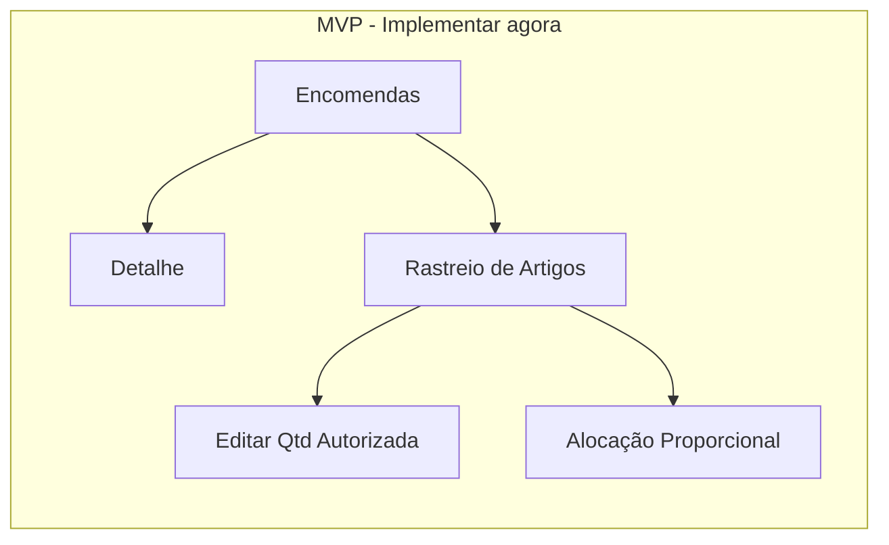
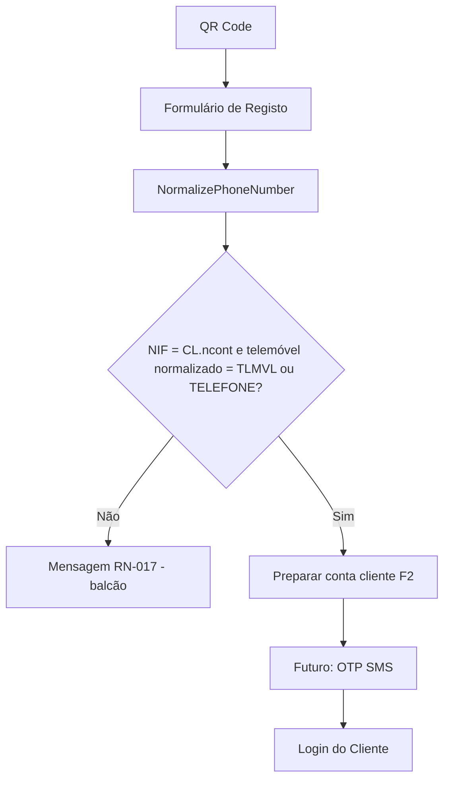

# Liliana & Seródio — Portal de Logística e B2B

> **ATENÇÃO (2026-09-29):** este ficheiro é a **baseline de arquitectura** do projeto.  
> **Fonte de verdade do estado operacional actual:** [`docs/PROJECT-STATE.md`](./docs/PROJECT-STATE.md).  
> Emendas relevantes vs texto abaixo: (1) autorização/alocação usam **previsão de entrada**, **sem teto `ST.stock`** (RN-018 histórico); (2) SignalR = **invalidação** (`OperacoesHub` + `TvHub` público), sem payload de negócio; (3) Identity ASP.NET em tabelas `u_HcaLogi*` na **mesma** `Phc:ConnectionString`; (4) Centro/TV com dados PHC reais (`tv-kapps-resumo`).  
> Fluxos de ecrã actualizados: [`docs/business-flows.md`](./docs/business-flows.md). Índice: [`docs/README.md`](./docs/README.md).

**Documento de arquitetura** · MVP (fundações + logística de encomendas) · Fase 2 (Portal do Cliente) · Cash & Carry como capacidade futura

| | |
| --- | --- |
| Cliente | Liliana & Seródio |
| ERP | PHC CS (SQL Server) |
| Princípio de dados | **Sem BD de negócio própria do Portal** — dados operacionais no PHC SQL; Identity `u_HcaLogi*` na mesma connection string (não é BD de negócio separada) |
| Stack | .NET 8 Web API · Dapper (`view_HCA_*` + `sp_HCA_*`) · ASP.NET Identity (cookie) · SignalR · React · TypeScript · Material UI |
| Princípio governante | **RN-022 — Arquitetura Orientada à Mudança** (ver secção dedicada) |
| Identidade | ASP.NET Identity (`u_HcaLogi*`) + gate PHC `US` / `u_usaPort` — sem JWT no MVP |
| Idioma funcional | Português de Portugal (ver [Norma de Linguagem](#0-norma-de-linguagem)) |
| Implantação | **On-premises:** Windows Server 2022+ · IIS 10+ · ASP.NET Core .NET 8 · SQL Server PHC |
| Estado | Baseline aprovada; **operação actual** ver `docs/PROJECT-STATE.md` |
| Próxima fase (histórico) | Fase 0B / sprints — **já ultrapassada**; ver PROJECT-STATE |
| Data | 2026-08-10 (baseline); **emenda operacional 2026-09-29** |


---

## Âmbito do produto

### Implementar agora (MVP)

1. Autenticação (cookie/sessão sobre `US` + `u_portalph`)  
2. Painel Principal  
3. Encomendas  
4. Gestão de Quantidade e Preço (RN-020 / RN-021)  
5. Quantidade Autorizada (expedição / alocação)  
6. Rastreio de Artigos  
7. Alocação Proporcional  
8. Administração (opcional: info operacional + diagnóstico simples)  

> Identidade: tabela nativa **`US`**. **Único campo portal MVP:** `u_portalph` (PasswordHasher / PBKDF2). Autenticação por **cookie / sessão web** após login — **sem** JWT, `accessToken`, `refreshToken`, Bearer ou `/auth/refresh`. Sem ecrãs de manutenção de utilizadores/passwords/perfis/permissões/sessões no portal.

> Escrita: o portal escreve **principalmente** em campos `U_*` de logística em **BI**; `US.u_portalph` via PHC/SQL; **exceções aprovadas** em campos nativos (`BI.qtt`, **`BI.edebito`** + totais, `usr*` em BO/BI — RN-020 / RN-021). Tabela **CL** = só leitura no MVP (sem campos `U_*` novos). **Sem** `U_PORTALAUDIT` obrigatório no MVP.

### Capacidades futuras

| Capacidade | Classificação |
| --- | --- |
| **Portal Cliente B2B** | **Fase 2** — implementação futura planeada |
| **Cash & Carry** | **Capacidade futura** — não é módulo ativo da Fase 1 / MVP; auth C&C a definir mais tarde (pode diferir) |

Cash & Carry mantém-se documentado (campos `U_*` sugeridos, estados, rotas reservadas) para não bloquear evolução, **sem** ecrãs, sprints nem contratos detalhados no âmbito atual. Um portal Cash & Carry futuro **pode usar um modelo de autenticação diferente**, a definir mais tarde — **não** desenhar auth C&C no MVP.

---

## Estado do projeto

A fase de **desenho arquitetural está concluída**.

O projeto está **aprovado para desenvolvimento**.

A atividade imediata é a **Fase 0B — Preparação do ambiente** (confirmar `US`, criar **apenas** `US.u_portalph` + campos `U_*` de logística, SQL, utilizador piloto).  

A **Fase 0A — Discovery estrutural** está **confirmada** (Enciclopédia PHC + decisões de negócio). Ver [Fase 0A / 0B](#fase-0a--0b--discovery-e-preparação-do-ambiente).

Depois do GO da 0B: scaffold .NET 8 + React e Sprint 1.

Detalhe operacional: secções seguintes + [`docs/phc-database-discovery.md`](./docs/phc-database-discovery.md) + [`docs/implementation-plan.md`](./docs/implementation-plan.md).

---

## RN-022 – Arquitetura Orientada à Mudança

**Princípio governante** da solução completa (MVP, Fase 2 e capacidades futuras).

### Premissa de negócio

Os requisitos **podem mudar** durante o desenvolvimento e após a entrada em produção.  
A arquitetura deve absorver mudança com **impacto mínimo**.

### Objetivos

- Minimizar retrabalho  
- Suportar alterações futuras de negócio  
- Permitir crescimento incremental  
- Reduzir acoplamento  
- Preferir configuração a código  
- Permitir módulos futuros **sem redesenhar** o MVP  

### Princípios de aplicação

#### 1. Configuração em vez de valores fixos em código

No MVP, parâmetros de corte e séries residem em **defaults da aplicação** (`appsettings` / constantes: Segunda 12:00, Europe/Lisbon, `SerieEncomendasNdos`). Configuração em BD é **opcional no futuro** — **não** criar `U_PORTALCFG` no MVP.

#### 2. Desenho modular

Os módulos permanecem **isolados**:

| Módulo | Estado |
| --- | --- |
| Autenticação | MVP |
| Encomendas (Orders) | MVP |
| Rastreio de Artigos (Article Tracking) | MVP |
| Alocação (Allocation) | MVP |
| Administração | MVP |
| Portal do Cliente (Customer Portal) | Fase 2 |
| Cash & Carry | Capacidade futura |

Contratos claros entre módulos; sem dependências circulares.

#### 3. Baixo acoplamento

Alterações num módulo **não** devem obrigar a mudanças em módulos não relacionados.

#### 4. Extensão em vez de reescrita

Nova funcionalidade entra por **extensão e composição**, não por remodelação de módulos estáveis.

#### 5. Componentes de UI reutilizáveis

Tabelas, filtros, diálogos, vistas de auditoria e controlos de formulário devem ser reutilizáveis entre ecrãs e módulos.

#### 6. Acesso PHC encapsulado

O conhecimento de tabelas `BO` / `BI` / `ST` / `CL` / `US` concentra-se na **base de dados** (`view_HCA_*` + `sp_HCA_*`) e nos adaptadores Dapper na infraestrutura.  
A API **não** espalha SQL direto sobre essas tabelas.
Evitar espalhar detalhes PHC por controllers, UI ou múltiplas camadas de aplicação.

#### 7. Desenho preparado para o futuro

A arquitetura deve permitir acrescentar, **sem redesenhar o MVP**:

- Cash & Carry  
- Portal do Cliente  
- Novos tipos de documento  
- Novos fluxos de trabalho  
- Novas permissões  
- Novos estados  

*(Ex.: rotas `/cash-carry/*` reservadas, campos `u_cc*` opcionais, permissões futuras documentadas — preparação, não implementação no MVP.)*

### Implicações práticas

| Área | Diretriz RN-022 |
| --- | --- |
| Servidor (API) | Monólito modular + Clean Architecture; contextos delimitados; Dapper → **`view_HCA_*`** (leitura) e **`sp_HCA_*`** (escrita) |
| Interface | Funcionalidades por módulo; biblioteca de componentes partilhados |
| Configuração | MVP: appsettings/constantes; futuro: config opcional (sem inventar `U_PORTALCFG` agora) |
| PHC / SQL | Lógica crítica na BD (`view_HCA_*` / `sp_HCA_*`); API **sem** consultas diretas a `BO`/`BI`/`ST`/`CL`/`US` |
| Evolução | Sprint / fase acrescenta módulo ou extensão; não refatora o núcleo estável sem necessidade |

Este princípio **orienta** todas as decisões de desenho e implementação documentadas neste repositório.

---

## Arranque inicial do sistema

A plataforma exige **pelo menos um utilizador** na tabela nativa **`US`** com:

- `u_portalph` definido  

O hash é criado **via PHC / SQL** (nunca texto simples; PasswordHasher ASP.NET ou PBKDF2), **não** através da UI do portal.

### Exemplo de preparação inicial

| Item | Valor |
| --- | --- |
| Utilizador PHC (`US`) | Conta existente (ou criada no PHC) acordada com o cliente |
| `u_portalph` | Hash compatível com PasswordHasher / PBKDF2 |
| Acesso portal | Existe em `US` **e** hash válido **e** autenticação bem-sucedida |

Após o arranque, a **definição/atualização** de hash continua via **PHC / SQL**.  
O portal **não** disponibiliza ecrãs de manutenção de utilizadores, passwords, perfis, permissões ou sessões no MVP.

Ver [Gestão de Utilizadores](#gestão-de-utilizadores).

---

## Gestão de Utilizadores

A gestão de utilizadores PHC é efetuada na tabela nativa **`US`** (fonte de identidade).

Ciclo de vida (criar / password): **apenas no PHC**.

Para o portal MVP:

- Criar / manter utilizadores no PHC (`US`)  
- Definir via PHC / SQL: **apenas** `u_portalph`  
- **Não** criar: `U_PORTALUSER` / `U_PORTALREFRESH` / `U_PORTALCFG` / `U_PORTALAUDIT`  
- **Não** criar no MVP: `u_portalperfil`, `u_portalativo`, `u_portalfalhas`, `u_portallockuntil`, `CL.u_portalactive`  

O portal **consome** `US` para:

- Autenticação (utilizador + verificação do hash → cookie/sessão)  
- Mapeamento para `usrinis` (campo fonte exacto confirmado na 0B)  

**Não existem ecrãs de manutenção de utilizadores, passwords, perfis, permissões, configuração de corte nem gestão de sessões no MVP do portal.**  
Administração MVP (opcional): info operacional / diagnóstico simples — **sem** consulta de auditoria dependente de `U_PORTALAUDIT`; **sem** ecrãs de configuração.

### Separação de responsabilidades

| PHC / SQL | Portal |
| --- | --- |
| Criação / password em `US` | Autenticar (cookie/sessão) |
| Definição de `u_portalph` | Operação logística (acesso operacional completo no MVP) |
| Acessos Desktop PHC | Diagnóstico operacional (opcional) |

Perfis Operador/Supervisor/Administrador: **futuro/condicional** (não MVP). Cliente = Fase 2.  
No MVP, **todos os utilizadores autenticados** têm acesso operacional completo (incluindo ultrapassar o restante / confirmar alocação).

---

## Modelo de Auditoria

O portal comporta-se como um **cliente PHC**: quem alterou e quando deve ser visível **dentro do PHC** através dos campos nativos padrão (`usr*`). Auditoria detalhada portal (`U_PORTALAUDIT`) = **melhoria futura** — **não** requisito MVP / 0B / Sprint 1 / go-live.

### Auditoria MVP — Rastreio nativo PHC (visível no Desktop)

Em **cada** alteração de quantidade (**RN-020**) ou preço (**RN-021**), o portal atualiza:

| Tabela | Campos | Significado |
| --- | --- | --- |
| `BI` | `usrinis`, `usrdata`, `usrhora` | Última alteração da **linha** |
| `BO` | `usrinis`, `usrdata`, `usrhora` | Última alteração do **dossier** |

**Nunca** alterar os campos de criação:

| Tabela | Campos | Regra |
| --- | --- | --- |
| `BO` | `ousrinis`, `ousrdata`, `ousrhora` | Somente leitura |
| `BI` | `ousrinis`, `ousrdata`, `ousrhora` | Somente leitura |

**Responsabilidade:** integração com o PHC — o dossier aparece alterado como se a mudança tivesse sido feita no PHC Desktop.

### `U_PORTALAUDIT` — melhoria futura (**não** MVP)

Tabela de auditoria detalhada before/after: **não criar** no MVP.  
Consulta de auditoria na Administração: **não** no MVP (dependeria de `U_PORTALAUDIT`).

> A consulta de auditoria detalhada é uma melhoria futura. No MVP, a auditoria operacional é assegurada pelos campos nativos PHC `usr*` em `BO` e `BI`.

### Campos `U_*` de preservação (obrigatórios)

| Campo | Papel |
| --- | --- |
| `u_qttorig` | Valor original de `BI.qtt` antes da 1.ª alteração; **0** = ainda não preenchido; base do restante (`ISNULL(NULLIF(u_qttorig, 0), qtt) - qtt2`) |
| `u_prcorig` | Valor original do preço unitário antes da 1.ª alteração (**RN-021**); **0** = ainda não preenchido |

### Campos removidos (não criar)

`u_qttalteradapor` · `u_qttalteradaem` · `u_precoalteradapor` · `u_precoalteradoem` — **não são necessários**; o “quem/quando” do dossier é nativo (`usr*`).

---

## Fase 0A / 0B — Discovery e preparação do ambiente

| Subfase | Nome | Estado | Bloqueia Sprint 1? |
| --- | --- | --- | --- |
| **0A** | Discovery estrutural PHC | **Confirmada** (2026-08-10) | Não |
| **0B** | Preparação do ambiente (BD cliente) | **Em curso / pendente** | **Sim** |

> **Não** tratar “Fase 0” como Discovery única ainda aberta. A discovery estrutural (**0A**) está fechada; só a **0B** bloqueia o Sprint 1.

Detalhe operacional: [`docs/phc-database-discovery.md`](./docs/phc-database-discovery.md) · [`docs/phc-installation-checklist.md`](./docs/phc-installation-checklist.md) · [`sql/001_user_fields.md`](./sql/001_user_fields.md).

---

### Fase 0A — Discovery estrutural (**confirmada**)

Concluída com base na **Enciclopédia PHC** (`kb-manual-tecnico`) e nas decisões de negócio aprovadas.  
Não depende de acesso à BD Liliana & Seródio para se considerar fechada.

| Tema | Conclusão | Estado |
| --- | --- | --- |
| Tabelas `BO`, `BI`, `ST`, `CL` | Modelo padrão PHC CS | Confirmado |
| Stamps / fecho / datas / cliente | `bostamp`, `bistamp`, `fecho`, `dataobra`, `ousrhora`, `no`, `estab` | Confirmado |
| Registo F2 (RN-017) | `ncont`, `tlmvl`, `telefone` | Confirmado |
| Stock (RN-018) | `ST.stock` | Confirmado |
| Preço unitário (RN-021) | **`BI.edebito`** | Confirmado |
| Totais / líquidos | Recálculo obrigatório (equiv. **BOTOTS**) | Confirmado |
| Auditoria nativa | `usrinis` / `usrdata` / `usrhora` em BO/BI; `ousr*` só leitura | Confirmado |
| Restante a fornecer | `ISNULL(NULLIF(u_qttorig, 0), qtt) - qtt2` | Confirmado |
| Encomenda aberta | `fecho = 0` + original > `qtt2` | Confirmado |
| Representante | Fora de âmbito | Confirmado |
| Utilizadores na app | Via `US` + `u_portalph` + cookie/sessão; sem gestão UI no portal | Confirmado |

**Resultado 0A:** Discovery estrutural **GO** — pode orientar implementação e contratos.

---

### Fase 0B — Preparação do ambiente (**bloqueia Sprint 1**)

Trabalho na **BD / ambiente do cliente**. Só após estes itens o Sprint 1 pode começar.

#### Discovery e campos a criar (obrigatórios MVP)

- [ ] Confirmar tabela `US`
- [ ] Confirmar campo de login em `US`
- [ ] Confirmar campo de nome em `US`
- [ ] Confirmar campo de iniciais / fonte para `usrinis`
- [ ] Criar **apenas** `US.u_portalph`
- [ ] Criar `BI.u_qtdaut`
- [ ] Criar `BI.u_qtdautur`
- [ ] Criar `BI.u_qtdautdt`
- [ ] Criar `BI.u_qttorig`
- [ ] Criar `BI.u_prcorig`
- [ ] Confirmar `BI.edebito`
- [ ] Confirmar `ST.stock`
- [ ] Confirmar `SerieEncomendasNdos = 1`
- [ ] Confirmar updates `usr*` + recálculo de totais
- [x] Validar hash + login cookie
- [ ] Criar vistas `view_HCA_*` — ver [`sql/002_views_and_procedures.md`](./sql/002_views_and_procedures.md)
- [ ] Criar procedimentos `sp_HCA_*`
- [ ] Validar `SELECT` nas `view_HCA_*` e `EXEC` nas `sp_HCA_*`
- [ ] Conceder permissões SQL com a nomenclatura oficial à conta da aplicação

#### Não criar no MVP

- [x] **Não** criar `U_PORTALUSER`
- [x] **Não** criar `U_PORTALREFRESH`
- [x] **Não** criar `U_PORTALCFG`
- [x] **Não** criar `U_PORTALAUDIT`
- [x] **Não** criar `u_portalperfil` / `u_portalativo` / `u_portalfalhas` / `u_portallockuntil`
- [x] **Não** criar `CL.u_portalactive` (MVP — possível futuro Fase 2)
- [x] **Não** criar setup JWT

#### Configuração e acesso

- [ ] Registar `SerieEncomendasNdos = 1` em appsettings/constantes (sem `U_PORTALCFG`)
- [ ] *Verificação pontual* tipagem (ex. length de `usrinis`, existência de `edebito`, colunas `US`)
- [ ] Documentar mapeamento utilizador `US` → `usrinis` após validação
- [ ] Login SQL dedicado + permissões mínimas
- [ ] Arranque: pelo menos um utilizador `US` com `u_portalph` (**via PHC**)

#### Opcionais — Cash & Carry (não bloqueiam GO)

- [ ] Criar `BO.u_ccstatus` / `u_cccomment` / `u_ccuser` / `u_ccdate`

---

## Critérios para Início de Desenvolvimento (GO Sprint 1)

O Sprint 1 **só começa** quando a **Fase 0B** estiver completa.

| # | Critério | Subfase | Estado |
| --- | --- | --- | --- |
| 1 | Discovery estrutural concluída | **0A** | **Confirmada** |
| 2 | `US.u_portalph` + `U_*` em BI + `view_HCA_*` / `sp_HCA_*` | **0B** | **Feito UAT** |
| 3 | Sem `U_PORTAL*` / campos US extra / `CL.u_portalactive` / JWT | **0B** | **Feito** |
| 4 | Acesso SQL: `SELECT` em `view_HCA_*` + `EXEC` em `sp_HCA_*`; `usr*` + totais | **0B** | Script [`030`](./sql/030_grant_portal_app.sql) · execução UAT pendente |
| 5 | `SerieEncomendasNdos = 1` registado (appsettings) | **0B** | **Feito** (`Phc:SerieEncomendasNdos=1` no scaffold) |
| 6 | Utilizador piloto com hash + login cookie validado | **0B** | **Validado** (2026-08-10) — [validação cookie](./docs/fase-0b-validacao-login-cookie.md) |

**GO Sprint 1:** itens 1–6 cumpridos (0A já está).  
**NO-GO:** falta qualquer item **0B** — permanecer na preparação de ambiente.

---

## Índice

0. [Norma de Linguagem](#0-norma-de-linguagem)
1. [Arquitetura de Software](#1-arquitetura-de-software)
2. [Modelo de Domínio](#2-modelo-de-domínio)
3. [Estratégia de Mapeamento à Base de Dados](#3-estratégia-de-mapeamento-à-base-de-dados)
4. [Desenho da API](#4-desenho-da-api)
5. [Estrutura da interface React](#5-estrutura-da-interface-react)
6. [Estrutura de Pastas](#6-estrutura-de-pastas)
7. [Matriz de Permissões](#7-matriz-de-permissões)
8. [Wireframes](#8-wireframes)
9. [Roteiro de Desenvolvimento](#9-roteiro-de-desenvolvimento)
10. [Boas Práticas — Integração SQL PHC CS](#10-boas-práticas--integração-sql-phc-cs)

Secções pré-índice: [RN-022](#rn-022--arquitetura-orientada-à-mudança) · [Arranque](#arranque-inicial-do-sistema) · [Gestão de Utilizadores](#gestão-de-utilizadores) · [Modelo de Auditoria](#modelo-de-auditoria) · [Fase 0A/0B](#fase-0a--0b--discovery-e-preparação-do-ambiente)

---

## 0. Norma de Linguagem

### Regras

| Âmbito | Idioma |
| --- | --- |
| Interface (ecrãs, botões, etiquetas) | **Português de Portugal** |
| Menus | **Português de Portugal** |
| Estados de negócio | **Português de Portugal** |
| Perfis / papéis | **Português de Portugal** |
| Mensagens ao utilizador (erros, confirmações, toasts) | **Português de Portugal** |
| Documentação funcional e este documento (negócio) | **Português de Portugal** |
| Nomes de configuração apresentados ao administrador | **Português de Portugal** |
| Nomes técnicos de frameworks, bibliotecas, protocolos | Inglês permitido (ex.: .NET, React, SignalR, SQL Server, EF Core, Dapper) |
| Identificadores de código (classes, rotas HTTP, ficheiros) | Inglês técnico aceite; **valores de negócio** (status, labels) em PT |

### Glossário canónico (substituir termos EN)

| Evitar (EN) | Usar (PT-PT) |
| --- | --- |
| Operator | Operador |
| Supervisor | Supervisor |
| Administrator | Administrador |
| Customer | Cliente |
| Pending / Approved / Rejected / Invoiced / In Preparation | Pendente Aprovação / Aprovada / Rejeitada / Faturada / Em Preparação |
| OnCycle / Late | Dentro do Planeamento / Após Corte |
| Open Orders | Encomendas (em Aberto) |
| Article Tracking | Rastreio de Artigos |
| Dashboard | Painel Principal |
| Admin / Configuration | Administração |

### Menus principais (UI) — MVP

1. **Painel Principal**
2. **Encomendas**
3. **Rastreio de Artigos**
4. **Administração**

> O menu **Cash & Carry** é reservado para a capacidade futura; não aparece na navegação do MVP.

> Quando existir, “Cash & Carry” mantém-se como nome do módulo; estados e ações em português.

### Valores persistidos (recomendação)

Preferir gravar em `U_*` **códigos estáveis** e apresentar sempre a etiqueta PT na UI/API de leitura:

| Campo | Código | Etiqueta UI |
| --- | --- | --- |
| `u_ccstatus` | `PA` · `AP` · `EP` · `FT` · `RJ` | Pendente Aprovação · Aprovada · Em Preparação · Faturada · Rejeitada |
| planeamento (calculado) | `DP` · `AC` | Dentro do Planeamento · Após Corte |

> Perfis portal (`Operador` / `Supervisor` / `Administrador`) = **futuro/condicional** — **não** criar `u_portalperfil` no MVP. `Cliente` = Fase 2.

---

## 1. Arquitetura de Software

### 1.1 Visão

Portal web **mobile-first / touch-first**, tema escuro operacional, integrado **diretamente** na base SQL Server do PHC CS. No MVP, a aplicação é a **fonte de verdade operacional** para logística de encomendas (autorização de quantidades, ciclo semanal, rastreio e alocação); o **PHC permanece** responsável pela faturação, stock físico e criação/fecho de dossiers. A arquitetura permanece preparada para Cash & Carry e Portal Cliente B2B sem os incluir na implementação imediata.

```
┌─────────────────────────────────────────────────────────────────────────┐
│                      CLIENTES (Fase 2)                                   │
│           React PWA · Registo por QR Code · OTP SMS (futuro)             │
└───────────────────────────────┬─────────────────────────────────────────┘
                                │ HTTPS / cookie sessão
┌───────────────────────────────▼─────────────────────────────────────────┐
│                 UTILIZADORES INTERNOS (Fase 1)                           │
│      Utilizadores PHC (`US`) autenticados  (React + Material UI Dark)    │
└───────────────────────────────┬─────────────────────────────────────────┘
                                │ REST + SignalR (cookie)
┌───────────────────────────────▼─────────────────────────────────────────┐
│                      API / BFF (.NET 8)                                  │
│  Cookie auth · Rate limit · Correlation Id · usr* nativos                │
└───────┬───────────────────────────────┬─────────────────────────────────┘
        │                               │
┌───────▼──────────┐          ┌─────────▼──────────┐
│  Serviços de     │          │  Hub em tempo real │
│  Aplicação       │◄────────►│  SignalR           │
│  (CQRS-lite)     │          │  Encomendas/Stock  │
└───────┬──────────┘          └─────────┬──────────┘
        │                               │
┌───────▼───────────────────────────────▼─────────────────────────────────┐
│                    CAMADA DE ACESSO A DADOS                              │
│  Dapper → Vistas SQL (leitura) · Procedimentos armazenados (escrita)     │
│  Sem consultas diretas espalhadas sobre BO / BI / ST / CL / US           │
└───────────────────────────────┬─────────────────────────────────────────┘
                                │ SQL Server
┌───────────────────────────────▼─────────────────────────────────────────┐
│                      BASE DE DADOS PHC CS                                │
│  Tabelas: US · BO · BI · ST · CL (leitura) · TS · U_* em US/BI           │
│  Vistas: view_HCA_* · Procedimentos: sp_HCA_*                            │
└─────────────────────────────────────────────────────────────────────────┘
```

### 1.2 Identidade e autenticação (decisão fechada)

| Tema | Decisão |
| --- | --- |
| Modelo | **Identidade interna** à plataforma |
| Fonte | Tabela nativa PHC **`US`** |
| Campos portal `US` | **apenas** `u_portalph` (MVP) |
| Protocolo | **Cookie / sessão web** após login — **sem** JWT / Bearer / tokens na interface |
| Expiração JWT | **N/A** — sem JWT no MVP |
| Passwords | `PasswordHasher` do ASP.NET **ou** PBKDF2 — **nunca** em texto simples |
| Acesso | Existe em `US` **e** hash válido **e** autenticação bem-sucedida |
| RN-019 | **Melhoria futura** — **não** ativo no MVP; **não** criar campos de lockout |
| Fora de âmbito MVP | JWT · AD · Entra · Azure AD · refresh · `U_PORTALUSER` / `U_PORTALREFRESH` / `U_PORTALCFG` / `U_PORTALAUDIT` · `u_portalperfil` |

> Perfis Operador/Supervisor/Administrador = futuro/condicional. Cliente = Fase 2. No MVP: autenticado = acesso operacional completo.

### 1.3 Estilo arquitetural

Orientado por **[RN-022 – Arquitetura Orientada à Mudança](#rn-022--arquitetura-orientada-à-mudança)**.

| Decisão | Escolha | Justificação |
| --- | --- | --- |
| Modular Monolith (API) | Sim, com bounded contexts | Escala equipa pequena; split futuro sem reescrever domínio (**RN-022**) |
| Clean Architecture | API → Application → Domain → Infrastructure | Testabilidade; isolamento do T-SQL PHC (**RN-022 §6**) |
| CQRS-lite | Comandos → procedimentos · Consultas → vistas (Dapper) | SQL PHC na BD; API sem conhecimento das tabelas base |
| Multi-empresa | Single tenant | Uma BD PHC |
| BD de aplicação separada | **Não** | Persistência em tabelas/campos `U_*` na BD PHC |
| Configuração | Defaults appsettings/constantes (MVP) | Preferir configuração a hardcode quando existir mecanismo (**RN-022 §1**) |

### 1.4 Contextos delimitados

```
┌─────────────────┐  ┌──────────────────┐  ┌─────────────────┐
│ Logística (MVP) │  │ Identidade e     │  │ Administração   │
│ Encomendas      │  │ Acessos (MVP)    │  │ (MVP)           │
│ Rastreio Artigos│  │ US + cookie      │  │ Diagnóstico     │
│ Alocação        │  │                  │  │ operacional     │
└────────┬────────┘  └────────┬─────────┘  └────────┬────────┘
         │                    │                      │
         └──────────┬─────────┴──────────┬───────────┘
                    │                    │
         ┌──────────▼────────┐  ┌────────▼────────────┐
         │ Catálogo / Stock  │  │ Portal do Cliente   │
         │ (leitura MVP)     │  │ (Fase 2 - futuro)   │
         └───────────────────┘  └─────────────────────┘

         ┌────────────────────────────────────────────┐
         │ Cash & Carry (capacidade futura)           │
         │ Auth C&C a definir mais tarde — não no MVP │
         └────────────────────────────────────────────┘
```

### 1.5 Aspetos transversais

- **Autenticação**: cookie/sessão; login em `US` + `u_portalph`.
- **Autorização MVP**: utilizador autenticado = acesso operacional completo (ultrapassar restante / alocação incluídos). Perfis = futuro.
- **Auditoria MVP**: nativos `usr*` PHC em BO/BI (ver [Modelo de Auditoria](#modelo-de-auditoria)). `U_PORTALAUDIT` = futuro.
- **Auditoria de quantidade autorizada** (linha BI): `u_qtdaut` + `u_qtdautur` + `u_qtdautdt`.
- **Auditoria de ajuste de quantidade/preço** (RN-020 / RN-021): originais `U_*` + nativos `BO`/`BI` `usr*`.
- **Escrita nativa aprovada:** `BI.qtt`, **`BI.edebito`** (+ totais linha/cabeçalho), `usrinis`/`usrdata`/`usrhora` em `BI` e `BO`; restantes campos nativos só leitura.
- **Concorrência**: updates em `BI` com `bistamp` + valor anterior esperado.
- **Tempo real**: SignalR — alterações de autorização / stock (cookie).
- **Configuração**: defaults appsettings (corte Segunda 12:00, `ndos` encomendas). Stock disponível fixo por **RN-018** (`ST.stock`).
- **Observabilidade**: Serilog; OpenTelemetry nas queries Dapper.

### 1.6 Arquitetura de Implantação

**Modelo oficial (decisão final):** on-premises.

| Componente | Tecnologia |
| --- | --- |
| Sistema operativo | Windows Server 2022 (ou superior) |
| Servidor web | IIS 10+ |
| API | ASP.NET Core .NET 8 (Hosting Bundle) |
| Interface | React SPA servido pelo IIS |
| Base de dados | SQL Server (base PHC CS), rede interna |

```
React SPA
        ↓
IIS (HTTPS)
        ↓
ASP.NET Core .NET 8 API
        ↓
SQL Server PHC
```

| Camada | Hospedagem |
| --- | --- |
| Interface | Site IIS (ficheiros estáticos do `npm run build`) |
| Servidor (API) | Aplicação / site IIS (ASP.NET Core Module) |
| SQL Server | Rede interna; porta 1433 **não** exposta à Internet |
| TLS | **HTTPS obrigatório** (porta 443); HTTP 80 → redirect |
| Autenticação | **Cookie / sessão web** |

A plataforma usa autenticação por **cookie/sessão** e **não depende** de:

- JWT / `accessToken` / `refreshToken` / Bearer  
- `/auth/refresh`  
- Windows Authentication  
- Active Directory  
- Microsoft Entra ID  
- Azure AD  
- Identity Providers externos  

mesmo quando hospedada em IIS.

**MVP:** logout = `POST /auth/logout` limpa cookie/sessão.

**Não** são arquitetura alvo: Kubernetes, Azure App Service, orquestração de contentores ou cloud-native como modelo primário. Implantação em cloud pode ser considerada apenas como **possibilidade futura**, sem alterar o desenho on-premises.

Ambientes: Local · Desenvolvimento · UAT · Produção. Connection strings e Data Protection fora do código; login SQL dedicado com permissões mínimas.

Documento detalhado: [`docs/deployment-architecture.md`](./docs/deployment-architecture.md).

---

## 2. Modelo de Domínio

### 2.1 Linguagem ubíqua

| Termo | Significado | PHC |
| --- | --- | --- |
| Encomenda em aberto | Encomenda de cliente com linhas por satisfazer | `BO` série encomendas, `fecho = 0`, e linhas com **`ISNULL(NULLIF(u_qttorig, 0), qtt) > qtt2`** |
| Quantidade por satisfazer | Restante a fornecer | **`ISNULL(NULLIF(u_qttorig, 0), qtt) - qtt2`** — gerido pela quantidade original do portal |
| Quantidade original (portal) | Qtd encomendada de referência para pendentes | `BI.u_qttorig` (**RN-020**) |
| Quantidade da linha | Qtd a fornecer (ajustável no portal) | `BI.qtt` (**RN-020** — exceção nativa) |
| Preço unitário | Preço unitário da linha (ajustável no portal) | `BI.edebito` (**RN-021**) |
| Preço unitário original | Preço PHC original preservado na 1.ª alteração | `BI.u_prcorig` (**RN-021**) |
| Quantidade autorizada | Qtd autorizada a expedir (portal / alocação) | `BI.u_qtdaut` |
| Ciclo de planeamento | Ciclo semanal | Entradas **antes** de Segunda 12:00 (configurável) |
| Após Corte | Encomenda depois da hora de corte | Destaque visual (âmbar) |
| Dentro do Planeamento | Encomenda dentro do ciclo | Cor primária |
| Encomenda Cash & Carry | Capacidade futura — encomenda de armazém (série dedicada) | `BO.ndos = {SérieCashCarry}` (quando ativado) |
| Stock disponível | Valor em `ST.stock` (**RN-018**) | `ST.stock` — sem cálculos derivados |

### 2.2 Agregados

```
Encomenda (Aggregate Root)
  id: BoStamp
  numero: Obrano
  serie: Ndos
  cliente: ClienteRef
  dataHora: DateTime (dataobra + ousrhora)
  estadoDocumento: Aberto | Fechado
  estadoPlaneamento: DentroDoPlaneamento | AposCorte
  linhas: LinhaEncomenda[]

LinhaEncomenda
  id: BiStamp
  artigo: ArtigoRef
  qtdEncomendadaOriginal: u_qttorig   // referência para pendentes; preenchida na 1.ª alteração RN-020 (ou = qtt até lá)
  qtdLinha: Qtt                                 // BI.qtt — ajustável (RN-020)
  qtdFornecida: Qtt2
  qtdPorSatisfazer: ISNULL(NULLIF(u_qttorig, 0), Qtt) - Qtt2
  precoUnitario: edebito                        // ajustável (RN-021)
  precoUnitarioOriginal: u_prcorig    // preenchido na 1.ª alteração RN-021
  qtdAutorizada: u_qtdaut
  autorizadaPor: u_qtdautur
  autorizadaEm: u_qtdautdt
  // Última alteração dossier/linha: BO/BI usrinis, usrdata, usrhora (nativos PHC)
  // usr* nativos BO+BI (MVP); sem U_PORTALAUDIT obrigatório


ProcuraArtigo (read model)
  codigoArtigo
  totais (encomendada, fornecida, porSatisfazer, autorizada, disponivel)
  encomendas: FatiaEncomendaArtigo[]

AprovacaoCashCarry (Aggregate — capacidade futura, não no MVP)
  encomenda: BoStamp
  estado: PendenteAprovacao | Aprovada | EmPreparacao | Faturada | Rejeitada
  comentario
  decididoPor / decididoEm

PlanoAlocacao (transitório — MVP)
  artigo
  disponivel
  alocacoes: { biStamp, qtdProposta }[]
```

### 2.3 Regras de domínio

1. **Linha em aberto**: `ISNULL(NULLIF(u_qttorig, 0), qtt) > qtt2` e documento não fechado (`fecho = 0`).
2. **Quantidade por satisfazer** = `ISNULL(NULLIF(u_qttorig, 0), qtt) - qtt2` (restante gerido pela **quantidade original**, não por `BI.qtt` ajustado).
3. **Quantidade autorizada ≥ 0** e **≤ quantidade por satisfazer** (ultrapassar o restante: utilizador autenticado no MVP; restrição por perfil = futuro).
4. **Soma das quantidades autorizadas por artigo ≤ stock disponível** (`ST.stock`, RN-018) (na gravação / alocação).
5. **Alocação proporcional**:
   - `disponivel = ST.stock` (RN-018)
   - `restante_i = ISNULL(NULLIF(u_qttorig_i, 0), qtt_i) - qtt2_i`
   - `share_i = restante_i / Σ restante`
   - `auth_i = floor(disponivel * share_i)`
   - unidades residuais pelo maior resto / FIFO por data da encomenda.
6. **Corte de planeamento**: `dataHora < SegundaAtual(config.Hora)` → **Dentro do Planeamento**; senão → **Após Corte** (defaults appsettings no MVP).
7. **Cash & Carry (capacidade futura)**: quando implementado, o portal **não** cria faturas (`FT`); apenas atualiza estado `U_`; **Faturada** quando o PHC fatura. **Fora do MVP.** Auth C&C a definir mais tarde.
8. **Registo de cliente (Fase 2)** — ver **RN-017**: normalizar telemóvel (`NormalizePhoneNumber`) e validar `CL.ncont` + `CL.tlmvl` (ou `CL.telefone` se `tlmvl` vazio). Modelo de conta cliente a definir na Fase 2 (**sem** `U_PORTALUSER` no MVP).
9. **Auditoria de autorização**: em cada alteração de `u_qtdaut`, gravar `u_qtdautur` (login) e `u_qtdautdt` (data/hora).
10. **Bloqueio de conta (RN-019)** — **melhoria de segurança futura** (não MVP); **não** criar `u_portalfalhas` / `u_portallockuntil` / `u_portalativo` no MVP.
11. **Ajuste de quantidade da linha** — ver **RN-020**: atualizar `BI.qtt`; preservar original em `u_qttorig` só na **primeira** alteração (base da quantidade por satisfazer).
12. **Alteração de preço unitário** — ver **RN-021**: preço livre; preservar original em `u_prcorig` só na **primeira** alteração. Utilizador autenticado pode editar.
13. **Arquitetura orientada à mudança** — ver **RN-022**: configuração, modularidade, baixo acoplamento, extensão e acesso PHC encapsulado.
14. **Gestão de utilizadores / passwords** — `u_portalph` via **PHC / SQL**; o portal **não** tem ecrãs de manutenção.
15. **Representante** — **fora de âmbito** do portal (não usar `vendnm` / `vendedor`).

### 2.3.1 RN-017 – Validação de Registo de Cliente

O registo do portal apenas pode ser concluído quando existir uma ficha de cliente no PHC com correspondência entre:

- `CL.ncont` (NIF)

e

- `CL.tlmvl`

ou, caso `CL.tlmvl` esteja vazio,

- `CL.telefone`

#### Normalização de telemóvel (antes da comparação)

Antes de comparar o telemóvel introduzido com `CL.tlmvl` / `CL.telefone`, **normalizar ambos** os valores.

Remover:

- espaços  
- hífenes / travessões  
- parênteses  
- prefixo de país `+351`  

Exemplos equivalentes (mesmo número):

| Introduzido | Normalizado |
| --- | --- |
| `912345678` | `912345678` |
| `912 345 678` | `912345678` |
| `+351912345678` | `912345678` |
| `+351 912 345 678` | `912345678` |

Recomendação de implementação: função `NormalizePhoneNumber()`.

Exemplo: `"+351 912 345 678"` → `"912345678"`.

A normalização ocorre **antes** da validação RN-017.

Caso não exista correspondência (após normalização), o registo deve ser **bloqueado** e apresentada a mensagem:

> Não encontramos os seus dados nos nossos registos. Dirija-se por favor ao balcão para atualização dos dados de cliente.

Fluxo funcional:

1. Cliente lê o QR Code  
2. Introduz NIF  
3. Introduz telemóvel  
4. Sistema normaliza telemóvel introduzido e contactos PHC (`NormalizePhoneNumber`)  
5. Sistema procura ficha de cliente no PHC  
6. Correspondência: `CL.ncont` = NIF **e** (telemóvel normalizado = `CL.tlmvl` normalizado **ou**, se `CL.tlmvl` vazio/nulo, = `CL.telefone` normalizado)  
7. Se válido → preparar conta cliente (modelo Fase 2 a definir — **sem** `U_PORTALUSER` no MVP)  
8. Se inválido → bloquear registo com a mensagem acima  

### 2.3.2 RN-018 – Stock Disponível

> **Emenda 2026-09-29 (supersede parcial):** para **autorização de quantidades** e **alocação proporcional**, a capacidade operacional **não** é `ST.stock`.  
> Fonte actual = **previsão de entrada aberta** (`Previsto − Alocado`; pode ser negativa; não altera `ST.stock`).  
> Detalhe: [`docs/PROJECT-STATE.md`](./docs/PROJECT-STATE.md), [`docs/business-flows.md`](./docs/business-flows.md), SQL `068` / `082`.  
> O campo API `stockDisponivel` mantém o nome por legado, mas o valor é a disponibilidade da previsão.

**Texto histórico do MVP (2026-08 — RN-018 original):**

Para o MVP inicial, o stock disponível correspondia **diretamente** ao valor em `ST.stock` (sem `qttcli` / `qttfor` / reservas):

```text
StockDisponivel = ST.stock   -- RN-018 histórico
```

Essa regra **já não** governa autorização/alocação no Portal actual. `ST.stock` pode continuar a existir no PHC como stock físico; **não** é o teto de autorização do Portal.

### 2.3.3 RN-019 – Bloqueio de Conta (**melhoria futura — não MVP**)

**Não ativo no MVP.** Não criar `u_portalfalhas` / `u_portallockuntil` / `u_portalativo` na 0B.

Comportamento previsto quando for implementado no futuro:

1. Após **5** falhas de login consecutivas: incrementar falhas e bloquear ~15 minutos  
2. Enquanto bloqueado: negar novas tentativas de login (mensagem PT)  
3. Após expirar o bloqueio: permitir login e reiniciar o contador  

Aplica-se apenas a novas tentativas de login.

### 2.3.4 RN-020 – Ajuste de Quantidade da Linha

Quando um utilizador decide que **apenas parte** da quantidade encomendada será fornecida, a quantidade original deve ser preservada em `u_qttorig` (base do **restante a fornecer**) e `BI.qtt` atualizado com a quantidade aprovada para fornecimento.

**Procedimento (obrigatório) — quando a quantidade muda:**

1. Se `BI.u_qttorig = 0` → gravar o valor atual de `BI.qtt` em `BI.u_qttorig`  
2. Atualizar `BI.qtt`  
3. Atualizar `BI.usrinis`, `BI.usrdata`, `BI.usrhora`  
4. Atualizar `BO.usrinis`, `BO.usrdata`, `BO.usrhora`  
5. Recalcular valores de linha afectados (`etiliquido` / `ettdeb`) e totais do cabeçalho `BO` quando exigido pelo comportamento PHC (equivalente a **BOTOTS**)  

**Nunca** sobrescrever `BI.u_qttorig` quando já for **diferente de 0**.

> Campos `u_qttorig` / `u_prcorig` são `numeric(16,2) NOT NULL` no PHC. O valor **0** é o indicador técnico de “original ainda não preenchido” (não usar `NULL`).

**Não** alterar `BO.ousr*` nem `BI.ousr*`.  
**Não** usar `u_qttalteradapor` / `u_qttalteradaem`.  
**Sem** escrita obrigatória em `U_PORTALAUDIT` (melhoria futura).  
**Não** gravar só `qtt` sem recálculo de totais quando o PHC o exige — deixa o dossier inconsistente no Desktop.

**Exemplo 1 — primeira alteração**

| | Valor |
| --- | --- |
| Estado inicial `QTT` | 100 |
| Estado inicial `u_qttorig` | **0** (ainda não preenchido) |
| Utilizador decide fornecer | 50 |
| Resultado `u_qttorig` | **100** |
| Resultado `QTT` | **50** |

**Exemplo 2 — alterações subsequentes**

| | Valor |
| --- | --- |
| Após mudança 1 | `QTT = 50`, `u_qttorig = 100` |
| Mudança 2 | `QTT = 30` |
| Resultado | `u_qttorig = **100**` (inalterado), `QTT = **30**` |

**Permissões MVP:** utilizador autenticado (`US` + hash); acesso operacional completo (sem matriz de perfis).

Ver [Modelo de Auditoria](#modelo-de-auditoria).

### 2.3.5 RN-021 – Alteração de Preço Unitário

Qualquer utilizador autenticado do portal pode editar o **preço unitário** de uma linha de encomenda.

O preço é **completamente livre**. Não existem validações de:

- desconto máximo  
- preço mínimo  
- margem mínima  
- variação máxima  

Exemplos válidos: `10.00 → 9.50` · `10.00 → 7.00` · `10.00 → 15.00`.

**Procedimento (obrigatório) — quando o preço muda:**

1. Se `BI.u_prcorig = 0` → gravar o valor atual de **`BI.edebito`** em `BI.u_prcorig`  
2. Atualizar o campo nativo **`BI.edebito`** (preço unitário €)  
3. Recalcular valores de linha afectados (`etiliquido` / `ettdeb` conforme regras da série) e totais do cabeçalho `BO` (equivalente a **BOTOTS**)  
4. Atualizar `BI.usrinis`, `BI.usrdata`, `BI.usrhora`  
5. Atualizar `BO.usrinis`, `BO.usrdata`, `BO.usrhora`  

**Nunca** sobrescrever `BI.u_prcorig` quando já for **diferente de 0**.

> Como `u_prcorig` é `numeric(16,2) NOT NULL`, o valor **0** é usado como indicador técnico de “ainda não preenchido”. Se futuramente existirem preços originais reais a 0, deverá ser revista esta abordagem.

**Não** alterar `BO.ousr*` nem `BI.ousr*`.  
**Não** usar `u_precoalteradapor` / `u_precoalteradoem`.  
**Sem** escrita obrigatória em `U_PORTALAUDIT` (melhoria futura).  
**Não** gravar só `edebito` sem recálculo de totais — deixa o dossier inconsistente no PHC Desktop.

**Exemplo — primeira alteração**

| | Valor |
| --- | --- |
| Estado inicial `u_prcorig` | **0** (ainda não preenchido) |
| Preço PHC original (`edebito`) | 10.00 |
| `u_prcorig` após 1.ª alteração | **10.00** |
| Preço atual da linha | **9.50** |

Alterações posteriores **nunca** sobrescrevem `u_prcorig`.

**Permissões MVP:** utilizador autenticado.

Ver [Modelo de Auditoria](#modelo-de-auditoria).

### 2.3.6 RN-022 – Arquitetura Orientada à Mudança

Princípio **governante** da solução. Texto completo: [RN-022 – Arquitetura Orientada à Mudança](#rn-022--arquitetura-orientada-à-mudança).

Resumo: requisitos podem mudar; no MVP preferir defaults em appsettings/constantes, módulos isolados, baixo acoplamento, extensão em vez de reescrita, UI reutilizável, acesso PHC encapsulado, e desenho preparado para Cash & Carry / Portal Cliente / novos documentos, fluxos, permissões e estados **sem redesenhar o MVP**.
### 2.4 Enums (valores de negócio em PT)

```csharp
// Perfis portal = futuro/condicional (não MVP) — Cliente = Fase 2
// public enum PerfilPortal { Operador, Supervisor, Administrador, Cliente }

public enum EstadoPlaneamento
{
    DentroDoPlaneamento, // etiqueta: "Dentro do Planeamento"
    AposCorte            // etiqueta: "Após Corte"
}

public enum EstadoCashCarry // Capacidade futura — não usar no MVP
{
    PendenteAprovacao = 0,
    Aprovada = 1,
    EmPreparacao = 2,
    Faturada = 3,
    Rejeitada = 4
}
```

Auth MVP: cookie/sessão; identidade = utilizador `US` (login/nome apenas). Sem perfil no MVP.

---

## 3. Estratégia de Mapeamento à Base de Dados

### 3.1 Princípio

O portal escreve **principalmente** em campos e tabelas de utilizador `U_*`, com **exceções aprovadas** em campos nativos PHC.

| Tipo de dado | Onde vive |
| --- | --- |
| Documentos / linhas / stock / clientes | Tabelas nativas PHC (`BO`, `BI`, `ST`, `CL`, …) — **leitura**; escrita nativa só nas exceções abaixo |
| Extensões de negócio do portal | Campos de utilizador `U_*` em `US`/`BO`/`BI`/`CL` |
| Configuração MVP | appsettings / constantes (sem tabela `U_PORTALCFG`) |
| Identidade | `US` + `u_portalph`; cookie/sessão |
| Auditoria detalhada | `U_PORTALAUDIT` — **não criar** no MVP (futuro) |

#### Exceções aprovadas — escrita em campos nativos PHC

| Campo nativo | Regra | Notas |
| --- | --- | --- |
| `BI.qtt` | **RN-020** | Quantidade aprovada para fornecimento |
| Campo nativo de **preço unitário** da linha `BI` | **RN-021** | **`edebito`** (Pr.Unit.€) — fechado; *verificação pontual* tipagem na 0B |
| `BI.usrinis`, `BI.usrdata`, `BI.usrhora` | RN-020 / RN-021 | Última alteração da linha — **igual ao PHC Desktop** |
| `BO.usrinis`, `BO.usrdata`, `BO.usrhora` | RN-020 / RN-021 | Última alteração do dossier — **igual ao PHC Desktop** |

**Não alterar** campos de criação (`ousrinis`, `ousrdata`, `ousrhora`) em `BO`/`BI`.

Todos os **restantes** campos nativos PHC permanecem **somente leitura** para o portal.

### 3.2 Mapeamento nativo PHC

#### Cabeçalho — `BO`

| Domínio | Coluna PHC | Notas |
| --- | --- | --- |
| Id | `bostamp` | |
| Série | `ndos` | Confirmar na config local |
| Nome da série | `nmdos` | |
| Nº documento | `obrano` | |
| Data | `dataobra` | |
| Hora de criação | `ousrhora` | Para corte semanal |
| Nº cliente | `no` | |
| Estabelecimento | `estab` | |
| Nome cliente | `nome` | |
| Fechado | `fecho` | `0` = aberto (**fechada = 0**) |
| Última alteração | `usrinis`, `usrdata`, `usrhora` | **Escrita portal** quando linhas são ajustadas (RN-020/021) — como no PHC Desktop |
| Criação | `ousrinis`, `ousrdata`, `ousrhora` | `ousrhora` usada no corte semanal; **não** sobrescrever na alteração |

> **Representante** (`vendnm` / `vendedor`): **não utilizado** pelo portal — fora de âmbito.

#### Linhas — `BI`

| Domínio | Coluna PHC | Notas |
| --- | --- | --- |
| Id | `bistamp` | |
| FK cabeçalho | `bostamp` | |
| Artigo | `ref` | |
| Descrição | `design` | |
| Qtd encomendada / a fornecer | `qtt` | **Escrita portal permitida (RN-020)**; original em `u_qttorig` |
| Qtd fornecida | `qtt2` | Linha satisfeita se `qtt <= qtt2` — **somente leitura** |
| Por satisfazer | *(calc)* | **`ISNULL(NULLIF(u_qttorig, 0), qtt) - qtt2`** |
| Preço unitário | `edebito` | **Escrita portal (RN-021)**; original em `u_prcorig`; recalcular linha + totais `BO` |
| Última alteração (linha) | `usrinis`, `usrdata`, `usrhora` | **Escrita portal** em cada PATCH RN-020/021 — como no PHC |
| Criação (linha) | `ousrinis`, `ousrdata`, `ousrhora` | **Somente leitura** — não sobrescrever |

#### Stock — `ST`

| Domínio | Coluna | Notas |
| --- | --- | --- |
| Artigo | `ref` | |
| Descrição | `design` | |
| Stock | `stock` | |
| Enc. clientes | `qttcli` | Campo PHC existente; **não usado** no cálculo de disponibilidade do MVP |
| Enc. fornecedores | `qttfor` | Campo PHC existente; **não usado** no cálculo de disponibilidade do MVP |
| Disponível | `stock` | **RN-018:** `StockDisponivel = ST.stock` |

#### Cliente — `CL`

| Domínio | Coluna | Notas |
| --- | --- | --- |
| Nº | `no`, `estab` | |
| Nome | `nome` | |
| NIF | `ncont` | Validação de registo (RN-017) |
| Telemóvel | `tlmvl` | **Prioridade 1** na validação de registo |
| Telefone | `telefone` | **Prioridade 2** — só se `tlmvl` estiver vazio ou nulo |

**Prioridade de contacto para registo:**

1. `CL.tlmvl`  
2. `CL.telefone` (alternativa)

Não existe campo de utilizador dedicado a telemóvel do portal. A validação usa **apenas** campos nativos da ficha de cliente.

### 3.3 Campos de utilizador a criar

Criar via **Supervisor → Framework → Campos do utilizador**. Prefixo `U_`. Limite 254 campos/tabela.

| Tabela | Nome interno | Nome físico | Tipo SQL (PHC) | Uso |
| --- | --- | --- | --- | --- |
| `US` | `portalph` | `u_portalph` | `varchar(254) NOT NULL` | Hash da password do portal (PasswordHasher / PBKDF2) — **único campo portal MVP em US** |
| `BI` | `qtdaut` | `u_qtdaut` | `numeric(16,2) NOT NULL` | Quantidade autorizada a expedir |
| `BI` | `qtdautur` | `u_qtdautur` | `varchar(100) NOT NULL` | Utilizador que alterou a autorização |
| `BI` | `qtdautdt` | `u_qtdautdt` | `datetime NOT NULL` | Data/hora da alteração |
| `BI` | `qttorig` | `u_qttorig` | `numeric(16,2) NOT NULL` | Quantidade original — base do **restante a fornecer**; **0** = ainda não preenchido (RN-020) |
| `BI` | `prcorig` | `u_prcorig` | `numeric(16,2) NOT NULL` | Preço unitário original — **0** = ainda não preenchido (RN-021) |

> **NOT NULL:** como `u_qttorig` e `u_prcorig` não admitem `NULL`, o MVP usa **0** como indicador técnico de “original ainda não guardado”.  
> Restante = `ISNULL(NULLIF(BI.u_qttorig, 0), BI.qtt) - BI.qtt2`.

> **CL:** nenhum campo `U_*` obrigatório no MVP. A tabela `CL` é usada apenas para **leitura** de dados de cliente.  
> `CL.u_portalactive` poderá ser considerado na Fase 2, caso seja necessário controlar quais clientes têm acesso ao Portal Cliente B2B. **Não faz parte do MVP** do Portal Logístico.

> Quem/quando alterou `qtt` ou preço no Desktop: nativos `BO`/`BI` (`usrinis`, `usrdata`, `usrhora`). `U_PORTALAUDIT` = melhoria futura (**não criar** no MVP).

#### Campos reservados — capacidade futura Cash & Carry (**opcionais** na Fase 0B / MVP)

| Tabela | Nome interno | Nome físico | Tipo | Uso futuro |
| --- | --- | --- | --- | --- |
| `BO` | `ccstatus` | `u_ccstatus` | C | PA / AP / EP / FT / RJ |
| `BO` | `cccomment` | `u_cccomment` | M ou C | Comentário |
| `BO` | `ccuser` | `u_ccuser` | C | Quem decidiu |
| `BO` | `ccdate` | `u_ccdate` | D | Data da decisão |

Criar estes campos `BO` é **opcional** durante a Fase 0B. **Não são obrigatórios** para o GO de desenvolvimento nem para o go-live do MVP. Servem apenas como preparação arquitetural da capacidade futura Cash & Carry.

Em `BI`: visível na grelha; restringir às séries de encomenda (botão Documentos).

### 3.4 Tabelas `U_PORTAL*`

| Tabela | Estado MVP |
| --- | --- |
| `U_PORTALAUDIT` | **Não criar** — melhoria futura (não 0B / Sprint 1 / go-live) |
| `U_PORTALUSER` | **Não criar** — identidade = `US` |
| `U_PORTALREFRESH` | **Não criar** — sem tokens |
| `U_PORTALCFG` | **Não criar** — defaults em appsettings |

Também **não criar** no MVP: `u_portalperfil`, `u_portalativo`, `u_portalfalhas`, `u_portallockuntil`, `CL.u_portalactive`.

Identidade MVP: apenas `US.u_portalph` (ver §3.3). Logística MVP: apenas campos `U_*` em **BI** (ver §3.3). Sem campos novos em `CL` no MVP.

### 3.5 Configuração MVP (appsettings / constantes)

| Parâmetro | Etiqueta | Valor MVP |
| --- | --- | --- |
| `DiaCortePlaneamento` | Dia de corte do planeamento | `Segunda` |
| `HoraCortePlaneamento` | Hora de corte | `12:00` |
| `FusoHorario` | Fuso horário | `Europe/Lisbon` |
| `SerieEncomendasNdos` | Série de encomendas (ndos) | **1** (confirmar BD na 0B) |
| `SerieCashCarryNdos` | Série Cash & Carry — **futuro** | *(opcional)* |

> **Não existe** chave `ModoStockDisponivel`. O stock disponível não é configurável — ver **RN-018** (`StockDisponivel = ST.stock`).

`SerieEncomendasNdos` vem de configuração da aplicação (não hardcode espalhado; não inventar tabela `U_PORTALCFG` no MVP). Configuração editável em BD = **opcional futuro**.

### 3.6 Acesso a dados — Vistas (leitura) e procedimentos armazenados (escrita)

**Decisão técnica aprovada:** concentrar a lógica SQL PHC na base de dados.

```text
API .NET 8 → Dapper → view_HCA_* (leitura) | sp_HCA_* (escrita) → Tabelas PHC
```

| Tipo | Utilização | Exemplos |
| --- | --- | --- |
| **Vistas** `view_HCA_*` | Todas as leituras operacionais | `view_HCA_encomendas_abertas`, `view_HCA_encomenda_linhas`, `view_HCA_rastreio_artigos`, `view_HCA_artigo_encomendas`, `view_HCA_utilizadores` |
| **Procedimentos** `sp_HCA_*` | Escritas de negócio (logística) | `sp_HCA_atualizar_linha_qtt_preco`, `sp_HCA_atualizar_qtd_autorizada`, `sp_HCA_alocacao_proporcional` |
| **Exceção técnica** | Validação de login (não é escrita de negócio) | `sp_HCA_validar_login` |
| **Dapper** | Único acesso da API às vistas/procedimentos | Sem SQL espalhado sobre tabelas base |

> A regra geral é: views para leitura e stored procedures para escrita. A stored procedure `sp_HCA_validar_login` é uma exceção técnica permitida para encapsular a validação de login contra a tabela `US`, não representando uma escrita de negócio.

Catálogo e esboços SQL: [`sql/002_views_and_procedures.md`](./sql/002_views_and_procedures.md).

#### `view_HCA_encomendas_abertas`

Listagem de encomendas em aberto: `fecho = 0`, `ndos = 1`, restante `ISNULL(NULLIF(u_qttorig, 0), qtt) - qtt2 > 0`.  
Uma linha por documento com totais agregados. Scripts: `sql/012_create_view_HCA_encomendas_abertas.sql`, validação `sql/013_validate_view_HCA_encomendas_abertas.sql`.

#### `view_HCA_encomenda_linhas`

Detalhe das linhas: `bostamp`, `bistamp`, `obrano`, `dataobra`, cliente, `ref`, `design`, quantidades (`qtt`/`qtt2`/`u_qttorig`), restante, `edebito`/`u_prcorig`, autorização, `ST.stock` (RN-018), `usr*`.  
Scripts: `sql/014_create_view_HCA_encomenda_linhas.sql`, validação `sql/015_validate_view_HCA_encomenda_linhas.sql`.

#### `view_HCA_rastreio_artigos` · `view_HCA_artigo_encomendas`

Agregação da procura por artigo (`016`/`017`); encomendas/linhas abertas por `ref` (`018`/`019`). Stock = `ST.stock` (RN-018).

#### `view_HCA_utilizadores`

Dados mínimos de `US` para login: `userstamp` ← `usstamp`, `login` ← `usercode`, `nome` ← `username`, `usrinis` ← `iniciais`, `portal_hash` ← `u_portalph`.  
Filtros: `inactivo = 0` e `u_portalph` preenchido. Script: `sql/010_create_view_HCA_utilizadores.sql`.

#### Escrita de negócio (`sp_HCA_*`)

Procedimentos encapsulam RN-020 / RN-021 / autorização / alocação: originais, `usr*` BI+BO, totais (BOTOTS), **nunca** `ousr*`. Login: ver exceção `sp_HCA_validar_login` acima.  
Scripts: `sql/020`–`027`. Hub: `docs/fase-0b-sp-HCA.md`.

### 3.7 Dapper (sem consultas diretas às tabelas base)

| Tecnologia | Utilização |
| --- | --- |
| **Dapper** | Leitura das vistas `view_HCA_*`; execução dos `sp_HCA_*` |
| **EF Core** | **Não** mapear `BO`/`BI`/`ST`/`CL`/`US` para SQL operacional; autenticação via vista/procedimento + Dapper |

**Não** espalhar na API: `FROM bo`, `FROM bi`, `FROM st`, `FROM cl`, `FROM us`.  
**Não** mapear `U_PORTALUSER` / `U_PORTALREFRESH` / `U_PORTALCFG` / `U_PORTALAUDIT`. Preferir scripts SQL versionados (`sql/001_*`, `sql/002_*`) + “Atualizar a Tabela” no PHC para campos `U_*`.

---

## 4. Desenho da API

Base URL: `/api/v1`  
Autenticação: cookie / sessão web (credenciais) — **sem** Bearer / JWT  
Erros: Problem Details (RFC 7807)  
**Respostas de negócio** (estados, mensagens): português.

### 4.1 Autenticação

| Método | Caminho | Descrição | Quem |
| --- | --- | --- | --- |
| POST | `/auth/login` | Valida `US` + hash; body `{utilizador, password}` → `{utilizador:{login,nome}}` + Set-Cookie | anónimo |
| POST | `/auth/logout` | Limpa cookie/sessão | autenticado |
| GET | `/auth/me` | Utilizador da sessão (`login`, `nome` apenas) | autenticado |

**Não existe** `/auth/refresh`. Sem `accessToken` / `refreshToken` / `expiresAt` / `perfil`.

### 4.2 Encomendas

| Método | Caminho | Descrição | Quem |
| --- | --- | --- | --- |
| GET | `/encomendas/abertas` | Lista com filtros | autenticado |
| GET | `/encomendas/{boStamp}` | Detalhe + linhas | autenticado |
| GET | `/painel/kpis` | KPIs do Painel Principal | autenticado |

Parâmetros de filtro:

```
dataDe, dataAte, horaDe, horaAte, clienteNo, artigoRef,
estadoPlaneamento=DentroDoPlaneamento|AposCorte|Todos,
page, pageSize, sort
```

Exemplo de item:

```json
{
  "boStamp": "...",
  "numeroEncomenda": 12345,
  "clienteNo": 100,
  "clienteNome": "Cliente X",
  "data": "2026-08-10",
  "hora": "09:15:00",
  "totalLinhas": 8,
  "quantidadeTotal": 420,
  "quantidadePorSatisfazer": 180,
  "estado": "Aberto",
  "estadoPlaneamento": "Após Corte",
  "estadoPlaneamentoCodigo": "AC"
}
```

### 4.3 Gestão de quantidade e preço (RN-020 / RN-021)

| Método | Caminho | Descrição | Quem |
| --- | --- | --- | --- |
| PATCH | `/encomendas/linhas/{biStamp}` | Atualiza `quantidade` e/ou `precoUnitario` | autenticado |

```json
{
  "quantidade": 50,
  "precoUnitario": 9.50
}
```

**Comportamento**

1. Se for a **primeira** alteração de quantidade (`u_qttorig = 0`): gravar original.  
2. Atualizar `BI.qtt` (se enviado).  
3. Se for a **primeira** alteração de preço (`u_prcorig = 0`): gravar original de **`BI.edebito`**.  
4. Atualizar **`BI.edebito`** (se enviado).  
5. Recalcular linha (`etiliquido` / `ettdeb`) e totais `BO` (equivalente a **BOTOTS**) — obrigatório se qtt e/ou preço mudaram.  
6. Atualizar `BI.usrinis`, `BI.usrdata`, `BI.usrhora`.  
7. Atualizar `BO.usrinis`, `BO.usrdata`, `BO.usrhora`.  
8. **Não** alterar `ousr*` (criação).  
9. **Sem** escrita obrigatória em `U_PORTALAUDIT`.

Sem validações de desconto, margem ou variação de preço (**RN-021**).  
**Não** gravar só `qtt`/`edebito` sem recálculo de totais.

Ver [Modelo de Auditoria](#modelo-de-auditoria).

### 4.3.1 Quantidade autorizada (expedição / alocação)

| Método | Caminho | Descrição | Quem |
| --- | --- | --- | --- |
| PATCH | `/encomendas/linhas/{biStamp}/quantidade-autorizada` | Atualiza autorização + campos BI | autenticado |
| POST | `/encomendas/linhas/quantidade-autorizada/lote` | Atualização em lote | autenticado |

```json
{
  "quantidadeAutorizada": 25,
  "valorAnteriorEsperado": 10
}
```

Ao gravar com sucesso:

- `BI.u_qtdaut` = novo valor  
- `BI.u_qtdautur` = login do utilizador  
- `BI.u_qtdautdt` = data/hora atual  

Se a soma exceder stock → `409 Conflict` com mensagem em português.

### 4.4 Rastreio de artigos

| Método | Caminho | Descrição | Quem |
| --- | --- | --- | --- |
| GET | `/artigos/procura-aberta` | Agregação por artigo | autenticado |
| GET | `/artigos/{ref}/encomendas-abertas` | Expandir encomendas | autenticado |
| POST | `/artigos/{ref}/alocar` | Alocação proporcional (grava) | autenticado |
| POST | `/artigos/{ref}/alocar/previsualizar` | Simulação | autenticado |

```json
{
  "quantidadeDisponivel": 200,
  "modo": "Proporcional",
  "confirmar": true
}
```

### 4.5 Cash & Carry — capacidade futura

**Capacidade futura suportada pela arquitetura.** Rotas reservadas; **não fazem parte do MVP**. Sem contratos detalhados de request/response neste documento (ver `docs/api-contract.md`).

| Método | Caminho | Nota |
| --- | --- | --- |
| GET | `/cash-carry` | Reservado para futura implementação |
| GET | `/cash-carry/pendentes` | Reservado para futura implementação |
| POST | `/cash-carry/{boStamp}/aprovar` | Reservado para futura implementação |
| POST | `/cash-carry/{boStamp}/rejeitar` | Reservado para futura implementação |
| POST | `/cash-carry/{boStamp}/em-preparacao` | Reservado para futura implementação |
| POST | `/cash-carry/{boStamp}/comentario` | Reservado para futura implementação |

Estados previstos: Pendente Aprovação · Aprovada · Em Preparação · Faturada · Rejeitada.

### 4.6 Administração

| Método | Caminho | Descrição | Quem |
| --- | --- | --- | --- |
| GET | `/administracao/diagnostico` | Informação operacional / diagnóstico do portal | autenticado |
| GET | `/administracao/auditoria` | **Não no MVP** — dependeria de `U_PORTALAUDIT` (futuro) | — |

> **Não existem** no MVP: PUT de configuração de corte/séries, endpoints de utilizadores/passwords/sessões.  
> Corte e `SerieEncomendasNdos`: defaults da aplicação (visíveis no diagnóstico).

Administração MVP:

- Diagnóstico operacional (opcional)  
- Consultar informação operacional e de diagnóstico do portal  

> A consulta de auditoria detalhada é uma melhoria futura. No MVP, a auditoria operacional é assegurada pelos campos nativos PHC `usr*` em `BO` e `BI`.

### 4.7 Fase 2 — Portal do Cliente (âmbito fechado)

Incluir **apenas**:

| Capacidade | Rota (exemplo) |
| --- | --- |
| Registo QR Code | `POST /publico/registo/iniciar` |
| Confirmação / ativação (OTP futuro) | `POST /publico/registo/confirmar` |
| Login | `POST /auth/login` (cookie; modelo cliente F2 a definir) |
| Catálogo | `GET /catalogo/produtos` |
| Imagens | incluídas no catálogo / `GET /catalogo/produtos/{ref}/imagem` |
| Preços | no catálogo |
| Stock disponível | no catálogo (`ST.stock`, RN-018) |
| Nova encomenda | `POST /eu/encomendas` |
| Histórico de encomendas | `GET /eu/encomendas` |
| Estado das encomendas | no detalhe/histórico |
| Consulta de faturas | `GET /eu/faturas` |
| Download PDF | `GET /eu/faturas/{id}/pdf` |

**Fora de âmbito (não implementar / não documentar como funcionalidade):**

- Últimas Compras  
- Comprar Novamente  
- Recomendações  
- Funcionalidades avançadas de e-commerce  

#### `POST /publico/registo/iniciar`

Validação (**RN-017**):

1. Normalizar telemóvel introduzido e contactos PHC com `NormalizePhoneNumber()` (remover espaços, hífenes, parênteses e prefixo `+351`)  
2. `CL.ncont` = NIF introduzido  
3. Telemóvel normalizado = `CL.tlmvl` normalizado  
4. Se `CL.tlmvl` estiver vazio ou nulo → telemóvel normalizado = `CL.telefone` normalizado  

A normalização ocorre **antes** da comparação RN-017.

Se a validação falhar:

**HTTP 400**

```json
{
  "mensagem": "Não encontramos os seus dados nos nossos registos. Dirija-se por favor ao balcão para atualização dos dados de cliente."
}
```

Se válido: preparar conta cliente (modelo Fase 2 a definir — **sem** `U_PORTALUSER` no MVP). Futuro: OTP SMS.

### 4.8 SignalR

> **Emenda 2026-09-29:** o realtime actual é **invalidação**, não sincronização de DTOs. Ver [`docs/PROJECT-STATE.md`](./docs/PROJECT-STATE.md).

| Hub | Path | Auth | Grupo |
| --- | --- | --- | --- |
| `OperacoesHub` | `/hubs/operacoes` | Cookie (`[Authorize]`) | `operacoes` |
| `TvHub` | `/hubs/tv` | **Anónimo** (`[AllowAnonymous]`) | `tv` |

Eventos (sem payload de negócio): `dossier66Alterado`, `dossier65Alterado`, `kappsAlterado` → o cliente faz **refetch** das APIs existentes.

Ciclo: `ExternalChangeDetector` (watermarks BO/BI 66/65 + Kapps) + `ExternalChangeRealtimeHostedService` (intervalo **5 s**).

*(Estado Cash & Carry: reservado para capacidade futura.)*

**Texto histórico:** menções a eventos com payload de autorização/stock estão **desactualizadas**.

### 4.9 Documentação técnica da API

- Swagger / OpenAPI 3 em `/swagger`  
- Versionamento `/api/v1`  
- Idempotency-Key em POST de alocação  

---

## 5. Estrutura da interface React

### 5.1 Princípios UX

- Mobile first; alvos touch ≥ 44–48px  
- Tema escuro operacional  
- **Dentro do Planeamento**: azul/ciano · **Após Corte**: âmbar/laranja  
- Toda a UI em **português de Portugal**  
- Chips / ecrãs Cash & Carry: apenas quando a capacidade futura for ativada  

### 5.2 Shell da aplicação (MVP)

```
┌──────────────────────────────────────────────┐
│ Logo │ Portal Logística     [Utilizador][☰]  │
├──────┴───────────────────────────────────────┤
│ Painel Principal │ Encomendas │ Rastreio de  │
│ Artigos │ Administração                      │
├──────────────────────────────────────────────┤
│                 <Outlet />                   │
└──────────────────────────────────────────────┘
```

### 5.3 Painel Principal — KPIs (MVP)

| KPI | Descrição |
| --- | --- |
| Encomendas em Aberto | Contagem de encomendas com linhas por satisfazer |
| Encomendas Após Corte | Subconjunto com estado de planeamento Após Corte |
| Artigos em Rutura | Artigos com procura aberta e `ST.stock` ≤ 0 (RN-018) |
| Quantidade por Satisfazer | Soma `ISNULL(NULLIF(u_qttorig, 0), qtt) - qtt2` das linhas abertas |
| Quantidade Autorizada | Soma de `u_qtdaut` nas linhas abertas |
| Clientes Afetados | Nº distinto de clientes com encomendas em aberto |

> KPI **Encomendas Cash & Carry Pendentes**: reservado para capacidade futura.

### 5.4 Módulos

| Módulo | Rotas | Notas UI |
| --- | --- | --- |
| Autenticação | `/login` | Mensagens PT |
| Painel Principal | `/` ou `/painel` | Cards KPI MVP |
| Encomendas | `/encomendas`, `/encomendas/:boStamp` | Filtros + detalhe |
| Rastreio de Artigos | `/artigos` | Expand + alocação |
| Administração | `/administracao/diagnostico` | Info operacional + diagnóstico (opcional) — **sem** users / passwords / config UI / sessões |
| Auditoria detalhada (futuro) | `/administracao/auditoria` | **Não no MVP** — melhoria futura; dependeria de `U_PORTALAUDIT` |
| Registo público (F2) | `/r/:codigoQr` | Futuro |
| Cash & Carry | `/cash-carry` | **Não no MVP** — capacidade futura |

### 5.5 Estado e dados

- TanStack Query · Zustand/Context · cliente SignalR  
- Etiquetas de estado centralizadas (ex.: `labels/estados.ts`) — única fonte PT

### 5.6 Tokens de tema

```ts
palette: {
  mode: 'dark',
  background: { default: '#0B1220', paper: '#121A2B' },
  primary: { main: '#3DB2FF' },   // Dentro do Planeamento
  warning: { main: '#FFB020' },   // Após Corte
  success: { main: '#3DDC97' },   // Aprovada
  error: { main: '#FF5C5C' },     // Rejeitada
  info: { main: '#7B8CDE' },      // Em Preparação
}
```

---

## 6. Estrutura de Pastas

### 6.1 Monorepo

```text
LilianaSerodio.Portal/
├── README.md
├── docs/
│   └── ARCHITECTURE.md
├── src/
│   ├── backend/
│   │   ├── LilianaSerodio.Portal.sln
│   │   ├── src/
│   │   │   ├── Portal.Api/
│   │   │   ├── Portal.Application/
│   │   │   ├── Portal.Domain/
│   │   │   └── Portal.Infrastructure/
│   │   └── tests/
│   └── frontend/
│       └── src/
│           ├── app/
│           ├── shared/
│           │   └── i18n/                 # etiquetas PT (fonte única)
│           └── features/
│               ├── autenticacao/
│               ├── painel/
│               ├── encomendas/
│               ├── artigos/
│               ├── administracao/
│               ├── registo/              # Fase 2
│               └── cash-carry/           # Capacidade futura (não no MVP)
├── sql/
│   ├── 001_user_fields.md
│   └── 005_indexes_recommendations.sql
└── pipelines/
```

Pastas e nomes de projetos podem permanecer em inglês técnico; **textos de negócio** e pastas de features preferencialmente alinhados ao glossário PT (`encomendas`, `artigos`, `painel`).

---

## 7. Matriz de Permissões

### MVP (ativas)

Acesso = cookie/sessão válida (`US` + `u_portalph` + login OK).  
**Sem** matriz de perfis no MVP — utilizador autenticado = acesso operacional completo.

| Capacidade | Autenticado | Notas |
| --- | --- | --- |
| Login interno (cookie) | ✓ | |
| Ver Painel Principal (KPIs) | ✓ | |
| Ver encomendas em aberto / detalhe | ✓ | |
| Editar quantidade autorizada | ✓ | incl. ultrapassar o restante |
| Ajustar quantidade / preço (RN-020/021) | ✓ | + `usr*` nativos |
| Pré-visualizar e confirmar alocação | ✓ | |
| Diagnóstico operacional | ✓ | se ecrã existir (opcional) |
| Consultar `U_PORTALAUDIT` | ✗ | futuro |
| Configurar corte / séries via UI | ✗ | Defaults appsettings |
| Gestão utilizadores / passwords | ✗ | PHC / SQL |
| Registo / catálogo / faturas cliente | Fase 2 | |

> **Gestão de utilizadores** (criar, passwords, hash): efetuada no **PHC / SQL**.

### Permissões futuras — perfis / Cash & Carry

Restrições por perfil (Operador/Supervisor/Administrador) = **futuro/condicional**.

| Capacidade futura | Nota |
| --- | --- |
| Ver fila / comentar / aprovar Cash & Carry | Auth C&C a definir mais tarde |

Políticas MVP: apenas `RequireAuthenticatedUser` (sem políticas por perfil).

---

## 8. Wireframes

### 8.1 Painel Principal

```
┌────────────────────────────────────────────────────────────┐
│ ☰  PAINEL PRINCIPAL                      👤 Ana            │
├────────────────────────────────────────────────────────────┤
│ [Encomendas em Aberto] [Após Corte] [Artigos em Rutura]    │
│ [Qtd por Satisfazer] [Qtd Autorizada] [Clientes Afetados]  │
└────────────────────────────────────────────────────────────┘
```

### 8.2 Encomendas

```
┌────────────────────────────────────────────────────────────┐
│ ☰  ENCOMENDAS                            👤 Ana            │
├────────────────────────────────────────────────────────────┤
│ [Data ▾] [Hora ▾] [Cliente ▾] [Artigo ▾] [Ciclo ▾]         │
├────────────────────────────────────────────────────────────┤
│ LEGENDA  ■ Dentro do Planeamento   ■ Após Corte            │
├──────┬──────────┬──────┬──────┬──────┬──────┬─────────────┤
│ Nº   │ Cliente  │ Data │ Hora │ Linhas│ Qtd │ Estado      │
├──────┼──────────┼──────┼──────┼──────┼──────┼─────────────┤
│ 1042 │ Mercearia│ 08/08│ 09:10│  12  │ 340  │ Aberto (ciano)│
│ 1048 │ Café Sul │ 10/08│ 14:22│   4  │  80  │ Aberto (âmbar)│ ← Após Corte
└──────┴──────────┴──────┴──────┴──────┴──────┴─────────────┘
```

### 8.3 Detalhe da encomenda

```
┌────────────────────────────────────────────────────────────┐
│ ←  ENCOMENDA Nº 1042                                       │
│ Mercearia Central · 08/08/2026 09:10                       │
├────────────────────────────────────────────────────────────┤
│ Ref     Descrição      Orig.  QTT   QTT2  Preço  Autoriz.  │
│ A-001   Farinha 1kg     100  [ 50 ]   40 [ 9.50 ] [  60 ]  │
│ A-014   Açúcar 1kg       50  [ 40 ]   10 [ 1.20 ] [  40 ]  │
│         Por satisfazer = original - qtt2                   │
│         Orig. preço: u_prcorig (só 1.ª alt.)     │
│         Última alt. dossier: BO/BI usrinis+usrdata+usrhora │
│         + usr* nativos BO+BI                               │
├────────────────────────────────────────────────────────────┤
│                    [ Guardar alterações ]                  │
└────────────────────────────────────────────────────────────┘
```

> Por linha, o utilizador edita **Quantidade** (`BI.qtt`, RN-020) e **Preço unitário** (`BI.edebito`, RN-021) com recálculo de totais + `usr*` em BO/BI. Utilizador autenticado pode editar. **Sem** coluna/filtro de representante.

### 8.4 Rastreio de Artigos

```
┌────────────────────────────────────────────────────────────┐
│ RASTREIO DE ARTIGOS — PROCURA EM ABERTO                    │
├──────┬────────────┬──────┬──────┬──────┬──────┬───────────┤
│ Ref  │ Descrição  │ Enc. │ Forn.│ Rest.│ Disp.│ Aut. Tot. │
├──────┼────────────┼──────┼──────┼──────┼──────┼───────────┤
│ A-001│ Farinha    │ 500  │ 100  │ 400  │ 200  │ 180       │
│   └─ expandir ───────────────────────────────────────────  │
│      Cliente      Enc.    Pedido   Autorizada              │
│      Mercearia    1042    60       [ 30 ]                  │
│      Café Sul     1048    40       [ 20 ]                  │
│      [ Alocar automaticamente 200 ]  [ Guardar ]           │
└────────────────────────────────────────────────────────────┘
```

### 8.5 Administração

```
┌────────────────────────────────────────────────────────────┐
│ ☰  ADMINISTRAÇÃO                      👤 Utilizador        │
├────────────────────────────────────────────────────────────┤
│ Diagnóstico operacional (opcional)                              │
│   Ambiente · versão API · SQL OK · série ndos · corte (defaults)│
│                          [ Atualizar ]                         │
└────────────────────────────────────────────────────────────┘
```

> Sem ecrãs de utilizadores, passwords, configuração de corte editável, gestão de sessões ou consulta de auditoria detalhada — hash via PHC; corte via appsettings.  
> A consulta de auditoria detalhada é uma melhoria futura. No MVP, a auditoria operacional é assegurada pelos campos nativos PHC `usr*` em `BO` e `BI`.

### 8.6 Cash & Carry — capacidade futura

Sem wireframes de implementação no MVP. Quando ativado, estados previstos: Pendente Aprovação · Aprovada · Em Preparação · Faturada · Rejeitada.

### 8.7 Registo de cliente (Fase 2)

```
┌──────────────────────────────────────┐
│  QR → /r/ls-portal                   │
│                                      │
│  Liliana & Seródio                   │
│  Registo de Cliente                  │
│                                      │
│  NIF  [____________]                 │
│  Telemóvel [________]                │
│                                      │
│  [ Continuar ]                       │
│                                      │
│  Validação:                          │
│  1. NormalizePhoneNumber             │
│  2. CL.ncont                         │
│  +                                   │
│  CL.tlmvl                            │
│  ou                                  │
│  CL.telefone                         │
└──────────────────────────────────────┘
```

Se a validação falhar:

```
┌──────────────────────────────────────┐
│  ⚠ Não foi possível validar          │
│    os seus dados.                    │
│                                      │
│  Não encontramos os seus dados nos   │
│  nossos registos.                    │
│                                      │
│  Dirija-se por favor ao balcão para  │
│  atualização dos dados de cliente.   │
│                                      │
│  [ Voltar ]                          │
└──────────────────────────────────────┘
```

### 8.8 Fluxos





> Cash & Carry: ver secção **Capacidade futura** no roteiro e em `docs/business-flows.md` — sem fluxo de implementação no MVP.

---

## 9. Roteiro de Desenvolvimento

### Fase 0A – Discovery estrutural (**confirmada**)

Encerrada via Enciclopédia PHC + decisões de negócio. Ver [Fase 0A](#fase-0a--discovery-estrutural-confirmada).

### Fase 0B – Preparação do ambiente *(fase atual — bloqueia Sprint 1)*

Trabalho na BD do cliente. Cumprir: [Fase 0B](#fase-0b--preparação-do-ambiente-bloqueia-sprint-1) e [Arranque](#arranque-inicial-do-sistema).

- [ ] Confirmar `US` (login/nome/iniciais) + criar **apenas** `u_portalph` + campos `U_*` em **BI**; `u_cc*` **opcionais**; **sem** campos novos em `CL`
- [ ] **Não** criar `U_PORTAL*` / `u_portalperfil`/ativo/falhas/lockuntil / `CL.u_portalactive` / JWT
- [ ] Registar `SerieEncomendasNdos = 1` (appsettings); verificação pontual; documentar mapeamento `US` → `usrinis`
- [ ] Acesso SQL dedicado; confirmar `usr*` + totais
- [ ] Arranque: utilizador `US` com hash + validar login cookie (PHC)
- [ ] Atualizar checklist / discovery com resultados do cliente

**Só após GO 0B** ([Critérios para Início de Desenvolvimento](#critérios-para-início-de-desenvolvimento-go-sprint-1)) avançar para a Fase 1A.

### Fase 1A – Fundação

- [ ] Solution .NET 8 · React · Material UI
- [ ] Cookie auth · `US` + `u_portalph` · Dapper → `view_HCA_*` / `sp_HCA_*` (sem SQL direto a tabelas base)
- [ ] Layout base (menus MVP)
- [ ] Administração (opcional): diagnóstico operacional — **sem** `U_PORTALAUDIT`
- [ ] Norma de linguagem: etiquetas PT

### Fase 1B – Encomendas

- [ ] Lista · Filtros · Detalhe
- [ ] Gestão de quantidade e preço (RN-020 / RN-021) — `BI.qtt` + preço unitário
- [ ] Quantidade autorizada (expedição)
- [ ] Auditoria: originais `U_*` + nativos `usr*` em BO/BI (+ autorização)
- [ ] Painel Principal (KPIs MVP)
- [ ] Cores Dentro do Planeamento / Após Corte

### Fase 1C – Rastreio de Artigos

- [ ] Procura aberta · Agregação por artigo
- [ ] Alocação proporcional (`disponivel = ST.stock`, RN-018)
- [ ] Validação de stock (`ST.stock`)
- [ ] Testes unitários do algoritmo

### Fase 1D – Estabilização

- [ ] Testes · Segurança · Desempenho
- [ ] Publicação Windows Server + IIS (ver `docs/deployment-architecture.md`)
- [ ] Formação · Go Live do MVP

### Fase 2 – Portal Cliente B2B

- QR Code · Registo (RN-017) · Login  
- Catálogo · Preços · Stock · Imagens  
- Nova encomenda · Histórico · Estado  
- Faturas · PDF  
- OTP SMS (posterior)

### Capacidades futuras

#### Cash & Carry

**Capacidade futura suportada pela arquitetura.**  

Não constitui fase nem sprint do MVP. Quando o produto a ativar: estados Pendente Aprovação · Aprovada · Em Preparação · Faturada · Rejeitada; campos `u_cc*` em `BO`; rotas `/cash-carry/*` já reservadas no contrato da API. Um portal C&C futuro **pode usar um modelo de autenticação diferente**, a definir mais tarde.

**Estimativa MVP (Fases 0B–1D):** ordem de grandeza 8–12 semanas (1–2 full-stack), conforme preparação PHC — **Fase 0B é pré-requisito** do calendário de sprints.

---

## 10. Boas Práticas — Integração SQL PHC CS

### 10.1 Leitura

- **Apenas** via vistas `view_HCA_*` (Dapper).
- Filtros/paginação sobre a vista — **não** reescrever joins `BO`/`BI` na API.
- `WITH (NOLOCK)` só dentro das vistas de listagem onde leitura suja seja aceitável; escritas/autorização crítica preferir `READ COMMITTED` nos procedimentos.
- Pendente / aberto: regras já nas vistas (`fecho`, restante, `ndos = 1`).

### 10.2 Escrita

- **Apenas** via procedimentos `sp_HCA_*` (Dapper) para escritas de negócio.
- Exceção técnica: `sp_HCA_validar_login` — validação de login contra `US` (não é escrita de negócio).
- Os procedimentos de negócio implementam RN-020 / RN-021 / autorização / alocação: originais, `usr*` BI+BO, totais (BOTOTS), **nunca** `ousr*`.
- Sem `UPDATE`/`INSERT` direto a `BO`/`BI`/`US` na API.
- Sem `U_PORTALAUDIT` no MVP.
- Concorrência otimista: preferir parâmetro de versão / validação no procedimento.

### 10.3 Campos de utilizador

- Criar no PHC; **Atualizar a Tabela**; documentar em `sql/001_user_fields.md`.
- Vistas/procedimentos em `sql/002_views_and_procedures.md`.
- Prefixo `U_`; limite 254 campos/tabela.
- Registo cliente (**RN-017**): Fase 2.
- Bloqueio de conta (**RN-019**): **melhoria futura** — **não** criar campos no MVP.

### 10.4 Desempenho

- Índices em `BO`/`BI` alinhados às vistas (ndos, fecho, bostamp, ref).
- Plano de execução das vistas com o DBA.

### 10.5 Segurança

- Conta SQL mínima: `SELECT` em `view_HCA_*`, `EXECUTE` em `sp_HCA_*` (sem DDL; sem DELETE em BO/BI/ST/FT).
- Sem palavras-passe em claro; cookie/sessão + Data Protection fora do código.
- Sem AD / Entra / JWT nesta fase.
- RN-019 = melhoria futura (não MVP).

### 10.6 Alocação e stock

- **RN-018:** `StockDisponivel = ST.stock` (regra fechada; sem `qttcli` / `qttfor` / reservas).
- Transação ao gravar lote do mesmo artigo; revalidar `ST.stock` antes do COMMIT.
- Algoritmo proporcional: `disponivel = ST.stock`; testes com `sum(auth) ≤ ST.stock` e `auth_i ≤ restante_i`.

### 10.7 Coexistência com PHC Desktop

- Portal (MVP) = dono operacional do **ajuste de quantidade/preço** (RN-020 / RN-021) e da **quantidade autorizada** a expedir.
- Portal atualiza `BI.qtt`, **`BI.edebito`**, totais (BOTOTS) e **`usr*` em `BO`/`BI`** **via procedimentos armazenados**; restantes campos nativos = leitura.
- PHC = dono de `qtt2` / fecho / faturação e da restante lógica documental.
- Cash & Carry (`u_cc*`): dono futuro do portal quando a capacidade for ativada.

### 10.8 Testes

- Unitários: alocação, corte de planeamento (`Europe/Lisbon`), mapeamento de estados PT.
- Integração: UAT anonimizado.
- UI: Playwright (tablet).

---

## Apêndice A — Algoritmo de corte de planeamento

```csharp
// Config: Dia = Segunda, Hora = 12:00, Fuso = Europe/Lisbon
public static EstadoPlaneamento ObterEstado(
    DateTime dataHoraLocal,
    OpcoesPlaneamento opt)
{
    var inicioSemana = InicioSemana(dataHoraLocal.Date, DayOfWeek.Monday);
    var corte = inicioSemana.Add(opt.HoraCorte); // Segunda 12:00
    return dataHoraLocal < corte
        ? EstadoPlaneamento.DentroDoPlaneamento
        : EstadoPlaneamento.AposCorte;
}
```

Antes do corte → **Dentro do Planeamento**.  
Depois do corte → **Após Corte**.  
No MVP: defaults em appsettings/constantes (Segunda 12:00). Configuração em BD = opcional futuro.

---

## Apêndice B — Alocação proporcional

> **Emenda 2026-09-29:** o algoritmo abaixo é a **baseline 0B**. Em produção UAT, `disponivel` vem da **previsão aberta** (`069` / PR3-C), **não** de `ST.stock`. Ver [`docs/business-flows.md`](./docs/business-flows.md) e [`docs/PROJECT-STATE.md`](./docs/PROJECT-STATE.md).

```text
disponivel = ST.stock          -- RN-018 (obrigatório)
restante_i = ISNULL(NULLIF(u_qttorig_i, 0), qtt_i) - qtt2_i
R = sum(restante_i)
se R == 0 ou disponivel <= 0: devolver zeros

bruto_i = disponivel * (restante_i / R)
auth_i = floor(bruto_i)
sobra = disponivel - sum(auth_i)

atribuir +1 às linhas com maior (bruto_i - auth_i)
  (desempate: dataobra mais antiga, depois obrano)

auth_i = min(auth_i, restante_i)
```

Exemplo: artigo `A-001` com `ST.stock = 200` → quantidade disponível para alocação = **200**.

Ao gravar cada linha: atualizar `u_qtdaut`, `u_qtdautur`, `u_qtdautdt`.

---

## Apêndice C — Decisões em aberto (negócio / IT)

1. Confirmar `SerieEncomendasNdos = 1` na BD do cliente (valor esperado).  
2. Campo de hora: `ousrhora` vs outro (*verificação pontual*).  
3. Gama PHC (Tabelas de Utilizador).  
4. Campo exacto em `US` para mapear → `usrinis` (ex.: `usrinis`, `iniciais`, login) — documentar após 0B.  
5. Momento de ativação da capacidade Cash & Carry (fora do MVP).  
6. Certificado TLS (interno CA vs público) e nomes DNS internos.  
7. Nomes físicos das colunas de login/nome em `US` (discovery 0B).

> **Hosting:** decisão fechada — Windows Server + IIS + .NET 8 + SQL Server on-premises. Cloud apenas possibilidade futura.  
> **Stock disponível:** decisão fechada — **RN-018** `StockDisponivel = ST.stock`.  
> **Identidade:** decisão fechada — `US` + `u_portalph` + cookie/sessão; **sem** JWT; RN-019/`U_PORTALAUDIT`/perfis = futuro.  
> **Ultrapassar autorização / confirmação alocação:** utilizador autenticado (MVP); perfis = futuro.

---

## Apêndice D — Próximos passos concretos

1. Executar **Fase 0B** (confirmar `US`, criar só `u_portalph` + `U_*` logística, SQL, `ndos=1`, utilizador piloto, login cookie).  
2. Obter **GO Sprint 1**.  
3. Scaffold monorepo (.NET 8 + React).  
4. Fatia vertical MVP: Login cookie → Painel → Encomendas → Ajuste `BI.qtt`/`edebito` (RN-020/021 + `usr*`) → Guardar `u_qtdaut`.  
5. Rastreio + alocação + hardening.  

*Documento vivo — arquitetura aprovada; identidade MVP = US + cookie/sessão; 0A confirmada; próxima atividade = **Fase 0B**.*
