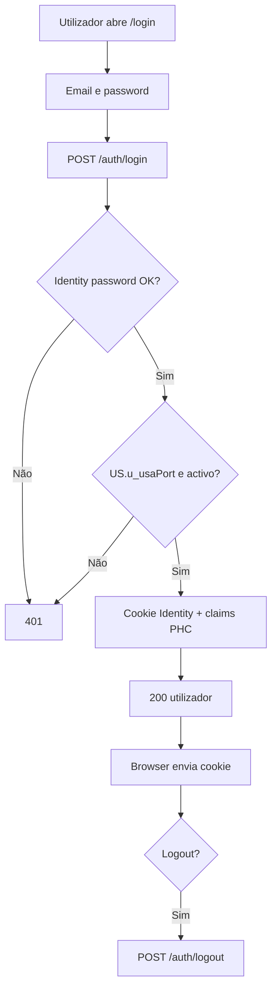
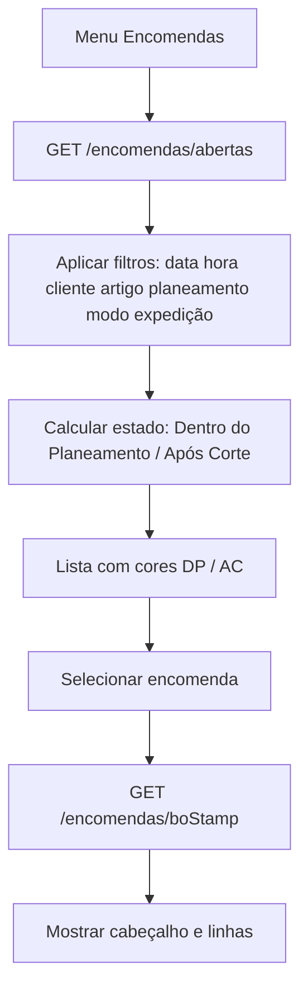
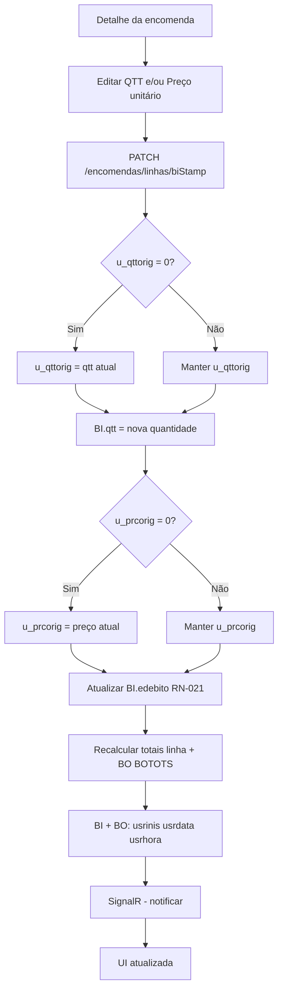
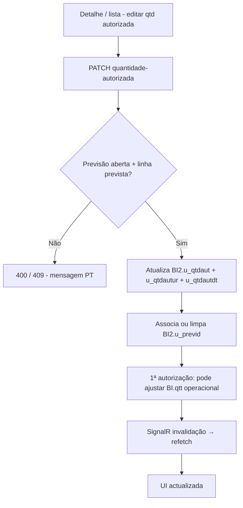
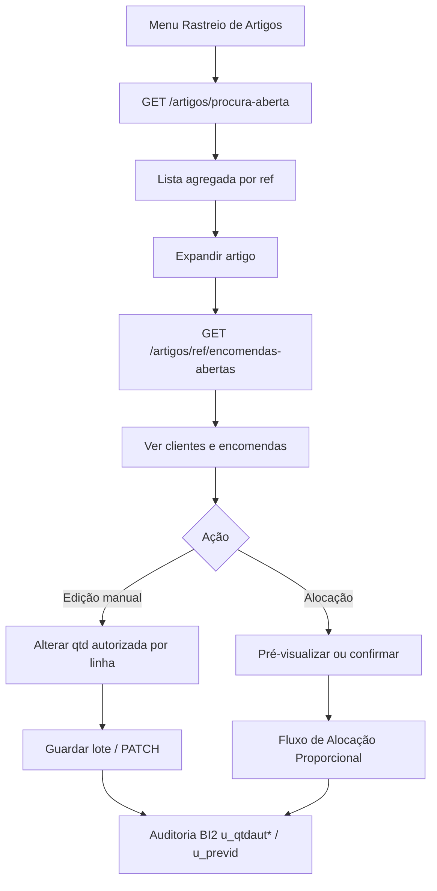
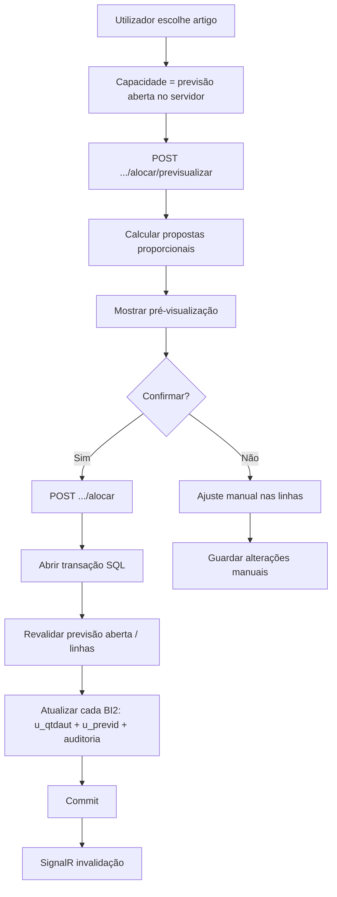
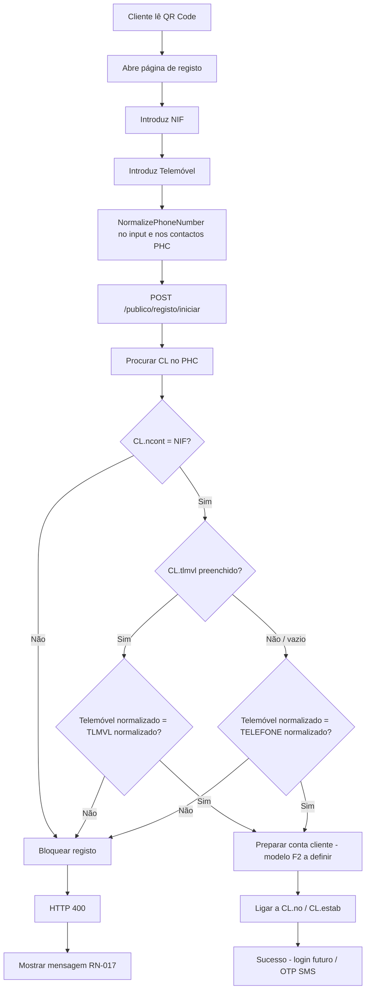
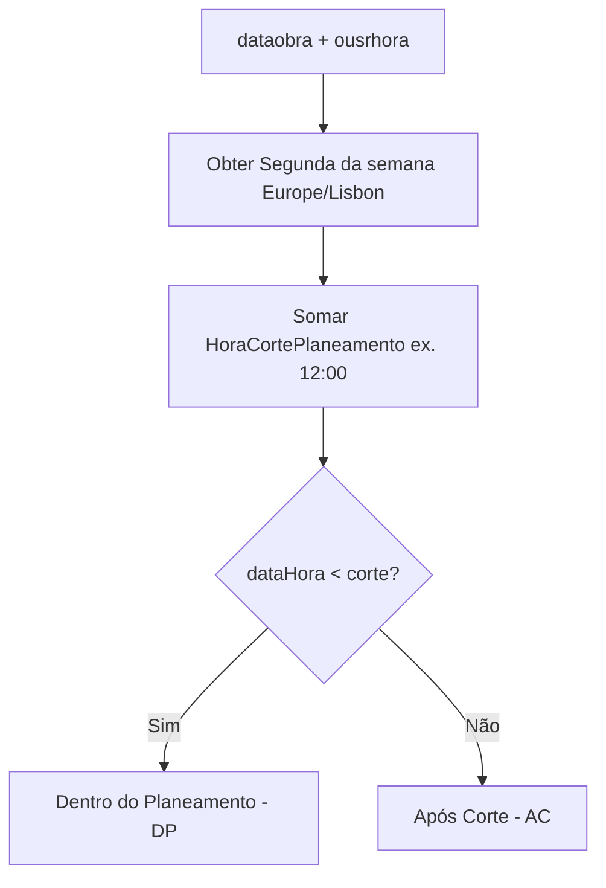

# Fluxos de Negócio

| | |
| --- | --- |
| Projeto | Liliana & Seródio — Portal de Logística e B2B |
| Fonte | [ARCHITECTURE.md](../ARCHITECTURE.md) |
| Estado operacional actual | **[`PROJECT-STATE.md`](./PROJECT-STATE.md)** — fonte de verdade (validação UAT, realtime, o que não implementar) |
| Princípio governante | **RN-022 — Arquitetura Orientada à Mudança** |
| Idioma | Português de Portugal |
| Âmbito detalhado | MVP + Registo Cliente (Fase 2) |
| Fora do detalhe de implementação | Cash & Carry (capacidade futura) |
| Actualizado | 2026-10-07 (Pendentes de Picagem — started ao nível encomenda) |

---

## Centro de Operações (UI)

Dados **reais do PHC** (Dapper / APIs). O ficheiro `centroMock.ts` é legado e **não** alimenta as páginas actuais.

| Superfície | Rota | Auth | Conteúdo / dados |
| --- | --- | --- | --- |
| Centro operacional | `/` | Cookie | Tabs Geral / Em Picking / Separado; KPIs `GET /api/v1/painel/centro-estados` (**número** = COUNT documentos; **%** = `distribuicaoLogica`); listas abertas + dossiers 66; Kapps via `GET /api/v1/painel/tv-kapps-resumo` |
| Vista TV | `/tv`, `/centro-tv` | **Público** | Mesma família de APIs + SignalR `/hubs/tv`; polling 30 s como fallback; mesmos 5 cards dual métrica |
| Check-in | `/check-in` | Cookie | Dossiers 66 sem check-in; marcar check-in |
| Em Picking | `/picking` | Cookie | Encomendas ndos=1 com `pronta_picking=1` e linha ainda por separar (`BI.qtt > SUM(66.qtt)`); estado Kapps via resumo (+ detalhe no expand) |
| Separado | `/expedicao` | Cookie | Dossiers ndos=66, `fechada=0`, `u_chkin=0`; **Qtd. documento** = `BI.qtt`; badge **Entrega parcial** se já expediu e ainda há pendente; expand: Documento / Expedida / Pendente |
| A Preparar Entrega | `/em-entrega` | Cookie | Dossiers 66 com check-in; acção **Voltar ao Separado** (`reverter-check-in`) |
| Em Expedição | `/expedido` | Cookie | Dossiers ndos=65 abertos; acção **Fechar expedição** (fecho operacional sem faturação → Concluídas) |
| Concluídas | `/concluidas` | Cookie | Dossiers ndos=65 fechados; **Reabrir** (BO+BI → Em Expedição) |
| Quantidades não entregues | `/nao-entregues` | Cookie | Dossiers **66** fechados com `SUM(qtt−qtt2)>0` (**IMPLEMENTADO**; API `GET /cortes-quantidade`) |
| Pendentes de Picagem | `/pendentes-picagem` | Cookie | Encomendas **ndos=1** abertas + `u_pickrdy=1` que **já iniciaram** o Picking (nível encomenda); vistas Por encomenda / Por referência; API `GET /pendentes-picagem` |

**Dual métrica nos KPIs (não confundir):** o número grande do card é o COUNT operacional da lista correspondente (ex. Em aberto = `pronta_picking=0`); a % é a fatia de **encomendas lógicas** (`bostamp` ndos=1), cada uma com **1,0 unidade repartida** pelos 66/65 activos (ex. 66+65 → 50%/50%). COUNT e % **não** têm de coincidir. Detalhe e UAT: [`PROJECT-STATE.md`](./PROJECT-STATE.md) § Centro / TV.

Realtime (**invalidação**, sem payload de negócio): `OperacoesHub` (`/hubs/operacoes`, autenticado) nas páginas operacionais; `TvHub` (`/hubs/tv`, anónimo) na TV. Eventos: `dossier66Alterado`, `dossier65Alterado`, `kappsAlterado`, `encomendaAlterada` → refetch das APIs existentes. Em `/picking`, `dossier66Alterado` actualiza também a lista de encomendas. Detalhe: [`PROJECT-STATE.md`](./PROJECT-STATE.md).

---

## Circuito operacional de armazém (séries)

```text
Encomenda (ndos=1)
      ↓  pronta picking / Kapps
Em Picking (ndos=1)
      ↓
Separado (ndos=66, fechada=0, u_chkin=0)     ← rota /expedicao
      ↓  check-in
A Preparar Entrega (ndos=66, u_chkin=1)      ← /em-entrega, /check-in
      ↓
Em Expedição (ndos=65, fechada=0)            ← rota /expedido
      ↓  Fechar expedição (Portal, sem faturação) / fecho PHC
Concluídas (ndos=65, fechada=1)              ← /concluidas
```

Cadeia documental (VALIDADO EM UAT 29/09/2026): `1 → 66 → 65` via `BI.obistamp` (65→66→1). Ver evidência e limites em [`PROJECT-STATE.md`](./PROJECT-STATE.md).

### Em Expedição — fecho operacional

```text
PATCH /api/v1/separacao-dossiers/{boStamp}/fechada  { "fechada": true }
  → sp_HCA_fechar_expedicao_dossier
  → BO.fechada=1 + BI.fechada=1 (linhas do bostamp)
  → lista Concluídas (fechada=1)
```

Reabrir: `{ "fechada": false }` → `sp_HCA_reabrir_expedicao_dossier` (BO+BI = 0).  
Não altera `qtt`/`qtt2`, não fatura. Detalhe: [`PROJECT-STATE.md`](./PROJECT-STATE.md).

### Separado — expedição parcial (UI)

```text
Qtd. documento = BI.qtt
Expedida       = BI.qtt2
Pendente       = BI.qtt − BI.qtt2

Entrega parcial (badge) =
  SUM(qtt2) > 0 AND SUM(qtt − qtt2) > 0
```

Lista: `GET /api/v1/picking-dossiers?fechada=false&checkIn=false` + campos `quantidadeDocumento` / `quantidadeExpedida` / `quantidadePendenteEntrega`.  
Não confundir com `quantidadeTotal` / `quantidadePorSatisfazer` (semântica `u_qttorig`).  
Linhas com pendente 0 **permanecem** visíveis. Detalhe: [`PROJECT-STATE.md`](./PROJECT-STATE.md).

### Quantidades não entregues (regra funcional)

> **Não** confundir com **corte de autorização** (`ndos=1`, `u_qttorig − u_qtdaut` — legado da vista `view_HCA_cortes_quantidade`; a API `/cortes-quantidade` passou a servir «Quantidades não entregues» via dossiers 66).

Regra operacional **validada** (UAT 30/09/2026):

```text
ndos = 66 AND fechada = 1 AND SUM(BI.qtt − BI.qtt2) > 0
```

| Label | Campo |
| --- | --- |
| Qtd. documento | `BI.qtt` |
| Expedida | `BI.qtt2` |
| Pendente | `BI.qtt − BI.qtt2` |

Rota UI: `/nao-entregues`. Expand: **todas** as linhas do dossier.  
Estado: **IMPLEMENTADO** — `GET /api/v1/cortes-quantidade` via `PickingDossiersQuery` (não a vista de corte). Ver [`PROJECT-STATE.md`](./PROJECT-STATE.md).

### Pendentes de Picagem

> **Não** confundir com **Em Picking** (`BI.qtt > SUM(66.qtt)` por linha). Pendentes responde à pergunta: *já iniciámos a picagem desta encomenda e ainda falta quantidade?*

```text
Encomenda preparada para Picking
        │
        │ nenhuma linha iniciou
        │ (Picked=0 e SUM66=0 em todas)
        ▼
   Não aparece
        │
        │ primeira quantidade física recolhida (Kapps A/N)
        │ ou quantidade integrada em 66
        ▼
Picking iniciado ao nível da encomenda
        │
        ▼
Avaliar todas as linhas (filtros de artigo/cor só depois do started)
        │
        ├── linha já em Kapps (Picked > 0)
        │      → Pending = qtt − qtt2 − Picked
        │
        ├── linha já materializada em 66 (Picked = 0, SUM66 > 0)
        │      → Pending = qtt − SUM66
        │
        └── linha ainda não iniciada (Picked = 0, SUM66 = 0)
               → Pending = qtt
        │
        ▼
Mostrar apenas Pending > 0
```

O facto de uma linha ainda **não** ter iniciado fisicamente o picking **não** a exclui se a encomenda já tiver iniciado o Picking através de outra linha.  
`SUM66` agrega **todos** os 66 da linha (sem `fechada`/`u_chkin`). **65** e sessões Kapps **não** entram no cálculo.  
UI: `/pendentes-picagem` · API: ver [`api-contract.md`](./api-contract.md). Estado: **FECHADO COM RESSALVA DE UAT** — [`PROJECT-STATE.md`](./PROJECT-STATE.md).

---

## RN-022 – Arquitetura Orientada à Mudança

Os fluxos abaixo descrevem o comportamento de negócio do **MVP** (e Fase 2 onde indicado).  
A forma como o software os implementa deve seguir **[RN-022](../ARCHITECTURE.md#rn-022--arquitetura-orientada-à-mudança)**:

| Princípio | Implicação nos fluxos |
| --- | --- |
| Configuração | Corte de planeamento e séries via **defaults da aplicação** (appsettings/constantes) no MVP — configuração em BD opcional no futuro |
| Módulos isolados | Login · Encomendas · Qtt/Preço · Autorização · Rastreio · Alocação · Administração separados |
| Baixo acoplamento | Evoluir um fluxo (ex. alocação) sem reescrever autenticação ou administração |
| Extensão | Cash & Carry / Portal Cliente entram como módulos futuros, sem redesenhar os fluxos MVP |
| PHC encapsulado | Passos que tocam PHC passam por **`view_HCA_*` / `sp_HCA_*`** (Dapper) — os diagramas descrevem *o quê*, não SQL solto na API |

Premissa: requisitos podem mudar; os fluxos documentados devem poder ser **estendidos** (novos estados, documentos, permissões) com impacto mínimo.

---

## Fluxo de Login

Autenticação **ASP.NET Identity** (`u_HcaLogiUsers`, email/password). Gate PHC: **`US.email`** + **`u_usaPort = 1`** + activo. Sessão por **cookie**.



> Password em `u_HcaLogiUsers`. `US.u_usaPort` controla acesso. Ver [`auth-portal-identity.md`](./auth-portal-identity.md).

---

## Fluxo de Encomendas



Regras:

- Linha em aberto: `ISNULL(NULLIF(u_qttorig, 0), qtt) > qtt2` e documento **não fechado** (`fecho = 0`)
- Quantidade por satisfazer = `ISNULL(NULLIF(u_qttorig, 0), qtt) - qtt2`
- Série = `SerieEncomendasNdos` (config da app; valor confirmado **1** na 0B)
- Planeamento: Antes do corte → Dentro do Planeamento; depois → Após Corte
- Filtro **Modo de Expedição** (`metodoExpedicao` ← `BO3.u_modExp`): Todos · Levantamento em Armazém · Transportadora · N/Viatura · Não definido — em todas as etapas por encomenda; na vista Por referência só Em Aberto (`procura-aberta`, agregação após filtrar linhas). Backend **1A** (Prev* por página + `page`/`pageSize` opcional): [`PROJECT-STATE.md`](./PROJECT-STATE.md). O FE **ainda não** pagina.
- **Sem** filtro de representante

---

## Fluxo de Gestão de Quantidade e Preço (RN-020 / RN-021)



> **Nota (2026-09):** o SignalR do Portal actual publica **invalidação** (eventos sem DTO) e a UI faz **refetch**; não sincroniza linhas/preços no payload. Ver [`PROJECT-STATE.md`](./PROJECT-STATE.md).

Regras:

- **RN-020:** se `u_qttorig = 0` → guardar original; nunca sobrescrever se `<> 0`; base do **restante a fornecer** **antes** da autorização plena; recalcular totais
- **RN-021:** `BI.edebito`; preço livre; se `u_prcorig = 0` → guardar original; nunca sobrescrever se `<> 0`; recalcular totais
- Originais `NOT NULL`: **0** = ainda não preenchido (`ISNULL(NULLIF(u_qttorig, 0), qtt) - qtt2`)
- **Após autorização:** `BI.qtt` tende a ser a quantidade operacional autorizada; o pedido original permanece em `BI2.u_qttorig` — ver secção «Quantidade Autorizada»
- Registo de alteração no dossier: nativos `usr*` em **BO e BI** (como no PHC Desktop); **não** alterar `ousr*`
- **Sem** escrita obrigatória em `U_PORTALAUDIT` (melhoria futura)
- Escrita nativa aprovada: `BI.qtt` + `BI.edebito` + totais (BOTOTS) + `usr*`
- Gestão de passwords portal: **via PHC / SQL** (sem ecrãs na app)
- **Sem** representante (`vendnm` / `vendedor`)

---

## Fluxo de Quantidade Autorizada

Capacidade operacional actual (**IMPLEMENTADO** / alinhado a [`PROJECT-STATE.md`](./PROJECT-STATE.md) e `sp_HCA_atualizar_qtd_autorizada` PR3-C):

```text
Disponibilidade UI/API (coluna ainda chamada stock_disponivel por legado)
  = QuantidadePrevista (previsão aberta, Ref + Cor)
  − SUM(u_qtdaut alocado nessa previsão para o mesmo Ref+Cor)

Pode ser negativa. Não usa ST.stock. Não altera ST.stock.
```



Regras actuais:

- Autorizada ≥ 0; concorrência otimista com valor anterior esperado.
- **Sem teto** pela previsão: pode autorizar acima do Previsto − Alocado (disponibilidade fica negativa).
- Exige **previsão de entrada aberta** e quantidade prevista para a Ref (+ Cor); previsão fechada → erro.
- `u_qtdaut > 0` → `BI2.u_previd` = Id da previsão; `u_qtdaut = 0` → `u_previd = ''` (nunca NULL).
- `@permitir_acima_stock` na API/SP é **legado e ignorado** (já não há teto ST.stock nem teto de previsão).
- **Não** usar `ST.stock` como disponibilidade operacional da autorização (RN-018 histórico desactualizado neste fluxo).
- Restrições por perfil = futuro.

### Campos após autorização (**CONFIRMADO**)

| Campo | Significado |
| --- | --- |
| `BI2.u_qttorig` | Quantidade originalmente pedida |
| `BI2.u_qtdaut` | Quantidade explicitamente autorizada |
| `BI.qtt` | Quantidade operacional actual (normalmente a autorizada **depois** da 1.ª autorização) |
| `BI.qtt2` | Quantidade fornecida PHC; read-only no Portal |

**Não assumir** que `BI.qtt` continua a representar a quantidade original depois da autorização.

Autorização inicial típica = quantidade pedida a satisfazer. Independente de `ST.stock` e de `STOBS.u_dispPort` (este último só controla se o artigo está no universo Portal).

---

## Fluxo de Rastreio de Artigos



---

## Fluxo de Alocação Proporcional

Capacidade (**IMPLEMENTADO**): vem da **previsão aberta** no SP — o cliente **não** envia `ST.stock` (`@disponivel` ignorado / null).

Algoritmo (proporcional sobre restantes a autorizar):

```text
disponivel = Previsto − Alocado_outros   -- previsão aberta, Ref (+ Cor); pode ser negativo após PR3-C
restante_i = ISNULL(NULLIF(u_qttorig_i, 0), qtt_i) - qtt2_i
             -- ou restante ainda não autorizado, conforme SP actual
R = sum(restante_i)
se R == 0: devolver zeros
-- PR3-C: sem teto de previsão; propostas proporcionais sobre restantes
bruto_i = ... (proporção sobre restantes)
auth_i = floor / distribuição de sobras
auth_i = min(auth_i, restante_i) quando aplicável
```

> O exemplo antigo «`ST.stock = 200` → disponível = 200» (**RN-018**) está **desactualizado** para este Portal: a fonte é a previsão, não `ST.stock`.



Propriedades: `auth_i` limitado ao restante da linha quando a SP assim o define; disponibilidade da previsão pode ficar negativa após gravação (PR3-C). Confirmação no MVP: **qualquer utilizador autenticado** (sem perfil Supervisor). Restrição por perfil = futuro.

---

## Fluxo de Registo Cliente (RN-017) — Fase 2



> **Portal Cliente = Fase 2.** Modelo de conta cliente a definir nessa fase (**sem** `U_PORTALUSER` no MVP atual).

### Normalização de telemóvel (antes da RN-017)

Remover espaços, hífenes, parênteses e prefixo `+351`.

Exemplos equivalentes: `912345678` · `912 345 678` · `+351912345678` · `+351 912 345 678` → todos `912345678`.

### Mensagem de erro (texto exacto)

> Não encontramos os seus dados nos nossos registos. Dirija-se por favor ao balcão para atualização dos dados de cliente.

### Prioridade de contacto

1. `CL.tlmvl`  
2. `CL.telefone` (se `tlmvl` vazio ou nulo)

---

## Fluxo de corte de planeamento (referência)



Valores MVP: defaults da aplicação (Segunda 12:00, Europe/Lisbon) — sem `U_PORTALCFG`.

---

## Capacidade Futura

Preparada pela arquitetura (**RN-022 §7**) — **não** implementada no MVP.

### Melhoria de segurança

- **RN-019** (lockout) — futuro; não criar campos no MVP  
- Perfis / matriz de perfis — futuro/condicional  
- `U_PORTALAUDIT` — melhoria futura (não 0B / Sprint 1 / go-live)

### Cash & Carry

A arquitetura foi desenhada para suportar futuramente um fluxo de aprovação Cash & Carry, mas esta funcionalidade **não faz parte do âmbito de implementação atual**.

> Um portal Cash & Carry futuro **pode usar um modelo de autenticação diferente**, a definir mais tarde — **não** desenhar auth C&C no MVP.

Estados previstos quando a capacidade for ativada:

- Pendente Aprovação
- Aprovada
- Em Preparação
- Faturada
- Rejeitada

Neste documento **não** se definem APIs, ecrãs, tarefas de desenvolvimento nem planeamento por sprint para Cash & Carry.

---

*Fluxos do MVP (cookie/sessão sobre US) e Fase 2; Cash & Carry apenas como capacidade futura. Governança: **RN-022**. Estado operacional e validações UAT: **[`PROJECT-STATE.md`](./PROJECT-STATE.md)**.*
